# Sequence Diagrams for Authentication Flows

## 1. Sign Up with Email & OTP Verification

```mermaid
sequenceDiagram
    actor Client
    participant UserController
    participant OtpService
    participant EmailService
    participant UserService
    participant PasswordEncoder
    participant OtpRepo as OtpVerificationRepository
    participant UserRepo as UserRepository
    participant DB as Database

    Note over Client,DB: Phase 1: OTP Generation & Email Sending
    Client->>UserController: POST /vhub/api/v1/user/verify?email={email}
    activate Client
    activate UserController
    UserController->>OtpService: generateOtp(email)
    activate OtpService
    
    OtpService->>OtpRepo: countByEmailAndCreatedAtAfter(email, 1hr ago)
    activate OtpRepo
    OtpRepo->>DB: COUNT query
    activate DB
    DB-->>OtpRepo: otpCount (e.g., 3)
    deactivate DB
    OtpRepo-->>OtpService: otpCount
    deactivate OtpRepo
    
    alt otpCount >= 10
        OtpService-->>UserController: RateLimitException
        UserController-->>Client: 429 Too many OTP requests
    else otpCount < 10
        OtpService->>OtpService: Generate random 6-digit OTP
        OtpService->>OtpRepo: save(otpVerification)
        activate OtpRepo
        OtpRepo->>DB: INSERT otp_verification
        activate DB
        Note over DB: Store OTP with 5-min expiry
        DB-->>OtpRepo: saved record
        deactivate DB
        OtpRepo-->>OtpRepo: saved record
        deactivate OtpRepo

        OtpService-->>UserController: otp (6-digit code)
        deactivate OtpService

        UserController->>EmailService: sendOtpEmail(email, otp)
        activate EmailService
        Note over EmailService: Send HTML email with OTP
        EmailService-->>UserController: email sent
        deactivate EmailService

        UserController-->>Client: 200 OK (success: true, otp)
    end
    deactivate UserController
    deactivate Client

    Note over Client,DB: Phase 2: User Registration with OTP Verification
    Client->>UserController: POST /vhub/api/v1/user/register<br/>(username, email, password, otp, etc.)
    activate Client
    activate UserController
    
    UserController->>OtpService: verifyOtp(email, otp)
    activate OtpService
    OtpService->>OtpRepo: findTopByEmailOrderByExpiresAtDesc(email)
    activate OtpRepo
    OtpRepo->>DB: SELECT latest OTP record
    activate DB
    DB-->>OtpRepo: latest OTP record
    deactivate DB
    OtpRepo-->>OtpService: latest OTP record
    deactivate OtpRepo

    alt OTP Valid
        Note over OtpService: Check: record exists AND<br/>otp code matches AND<br/>not expired (within 5 min)
        OtpService->>OtpRepo: setIsUsed(true)
        activate OtpRepo
        OtpRepo->>DB: UPDATE otp_verification SET is_used=true
        activate DB
        DB-->>OtpRepo: updated
        deactivate DB
        OtpRepo-->>OtpService: updated
        deactivate OtpRepo
        OtpService-->>UserController: true (verified)
        deactivate OtpService
    else OTP Invalid
        Note over OtpService: OTP mismatch or expired
        OtpService-->>UserController: false (not verified)
        deactivate OtpService
    end
    
    alt OTP Verified
        UserController->>UserService: createUser(request)
        activate UserService
        
        UserService->>UserRepo: existsByUsername(username)
        activate UserRepo
        UserRepo->>DB: COUNT WHERE username=?
        activate DB
        DB-->>UserRepo: exists (boolean)
        deactivate DB
        UserRepo-->>UserService: boolean
        deactivate UserRepo

        alt Username exists
            UserService-->>UserController: "Username is already in use"
            deactivate UserService
            UserController-->>Client: 200 OK (success: true, data: error message)
        else Username available
            UserService->>UserRepo: existsByEmail(email)
            activate UserRepo
            UserRepo->>DB: COUNT WHERE email=?
            activate DB
            DB-->>UserRepo: exists (boolean)
            deactivate DB
            UserRepo-->>UserService: boolean
            deactivate UserRepo

            alt Email exists
                UserService-->>UserController: "Email is already in use"
                deactivate UserService
                UserController-->>Client: 200 OK (success: true, data: error message)
            else Email available
                UserService->>PasswordEncoder: encode(password)
                activate PasswordEncoder
                PasswordEncoder-->>UserService: hashedPassword
                deactivate PasswordEncoder

                UserService->>UserRepo: save(newUser)
                activate UserRepo
                UserRepo->>DB: INSERT user
                activate DB
                Note over DB: Create User with:<br/>- hashed password<br/>- isActive=true<br/>- points=0<br/>- timestamps
                DB-->>UserRepo: saved user
                deactivate DB
                UserRepo-->>UserService: saved user
                deactivate UserRepo

                UserService-->>UserController: success message
                UserController-->>Client: 200 OK (success: true, data: user created)
                deactivate UserService
            end
        end
    else OTP Not Verified
        UserController-->>Client: 200 OK (success: true, message: "Fail", data: "Can not register user")
    end
    deactivate UserController
    deactivate Client
```

---

## 2. Sign In with Username and Password

```mermaid
sequenceDiagram
    actor Client
    participant AuthController
    participant AuthService
    participant JWTService
    participant RefreshTokenService
    participant UserRepo as UserRepository
    participant RefreshTokenRepo as RefreshTokenRepository
    participant DB as Database
    participant PasswordEncoder

    Client->>AuthController: POST /vhub/api/v1/auth/login<br/>(username, password)
    activate Client
    activate AuthController
    
    AuthController->>AuthService: login(username, password)
    activate AuthService
    
    AuthService->>UserRepo: findByUsernameAndIsActive(username)
    activate UserRepo
    UserRepo->>DB: SELECT WHERE username=? AND is_active=true
    activate DB
    DB-->>UserRepo: User record
    deactivate DB
    UserRepo-->>AuthService: Optional<User>
    deactivate UserRepo
    
    alt User Not Found
        AuthService-->>AuthController: CustomAuthenticationException<br/>("Invalid username or password")
        deactivate AuthService
        AuthController-->>Client: 401 Unauthorized (error response)
    else User Found
        AuthService->>PasswordEncoder: matches(password, user.passwordHash)
        activate PasswordEncoder
        Note over PasswordEncoder: Compare plaintext password<br/>with stored BCrypt hash
        PasswordEncoder-->>AuthService: boolean (match result)
        deactivate PasswordEncoder

        alt Password Mismatch
            AuthService-->>AuthController: CustomAuthenticationException<br/>("Invalid username or password")
            deactivate AuthService
            AuthController-->>Client: 401 Unauthorized (error response)
        else Password Match
            AuthService->>AuthService: Create LoginResponse
            Note over AuthService: loginResponse.id = user.id<br/>loginResponse.username = user.username

            AuthService->>JWTService: generateToken(user)
            activate JWTService
            Note over JWTService: Generate JWT with:<br/>- subject=username<br/>- roles<br/>- expiration time
            JWTService-->>AuthService: jwtToken
            deactivate JWTService
            Note over AuthService: loginResponse.token = jwtToken

            AuthService->>RefreshTokenService: createRefreshToken(user)
            activate RefreshTokenService
            RefreshTokenService->>RefreshTokenService: Generate UUID refresh token
            RefreshTokenService->>RefreshTokenRepo: save(refreshToken)
            activate RefreshTokenRepo
            RefreshTokenRepo->>DB: INSERT refresh_token
            activate DB
            Note over DB: Store refresh token<br/>with user reference<br/>and expiry timestamp
            DB-->>RefreshTokenRepo: saved token
            deactivate DB
            RefreshTokenRepo-->>RefreshTokenService: saved token
            deactivate RefreshTokenRepo
            RefreshTokenService-->>AuthService: refreshTokenString
            deactivate RefreshTokenService
            Note over AuthService: loginResponse.refreshToken = refreshTokenString

            AuthService-->>AuthController: LoginResponse (id, username, token, refreshToken)
            deactivate AuthService
        end
    end
    
    AuthController-->>Client: 200 OK<br/>(success: true,<br/>data: LoginResponse)
    deactivate AuthController
    deactivate Client
```

---

## Key Components Legend

| Component | Responsibility |
|-----------|----------------|
| **UserController** | Handles registration endpoints, orchestrates OTP verification and user creation |
| **AuthController** | Handles login endpoint, returns authentication response |
| **OtpService** | Generates OTP codes, verifies OTP codes, enforces rate limiting (max 10/hour) |
| **EmailService** | Sends OTP codes via email |
| **UserService** | Creates user accounts with validation and password hashing |
| **AuthService** | Authenticates users with username/password, generates tokens |
| **UserRepository** | Database access for User entities |
| **OtpVerificationRepository** | Database access for OTP records |
| **PasswordEncoder** | BCrypt password hashing and verification |
| **JWTService** | JWT token generation and validation |
| **RefreshTokenService** | Refresh token generation for session renewal |

---

## 3. View Current User Profile

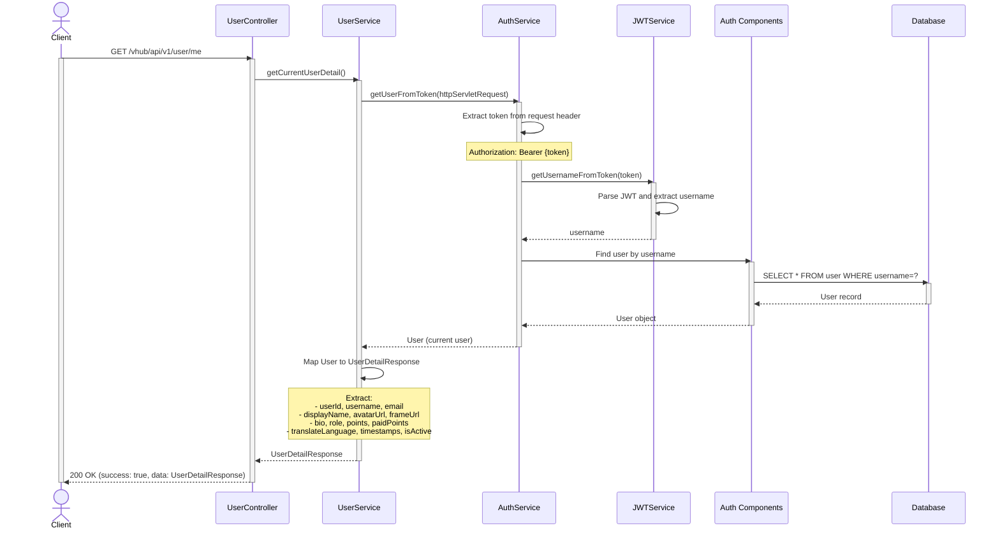

---

## 4. View User Details by ID

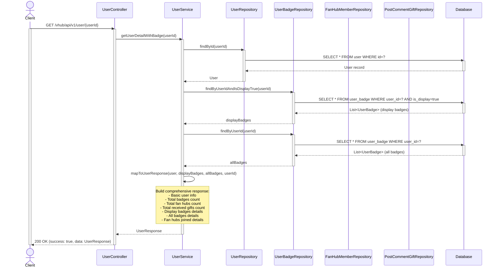

---

## 5. View User Details by Username

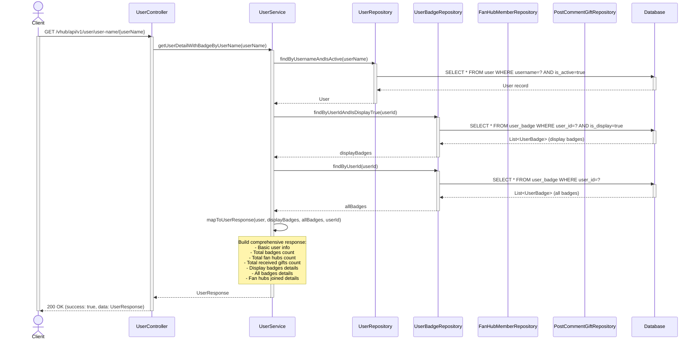

---

## 6. Update Profile

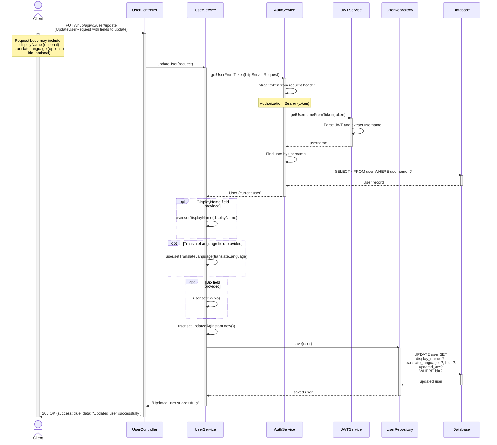

## 6.1 Update Email

```mermaid
sequenceDiagram
    actor Client
    participant UserController
    participant UserService
    participant AuthService
    participant PasswordEncoder
    participant UserRepo as UserRepository
    participant DB as Database

    Client->>UserController: PUT /vhub/api/v1/user/update-email<br/>(UpdateEmailRequest with new email and password)
    activate Client
    activate UserController
    
    UserController->>UserService: updateEmail(request)
    activate UserService
    
    UserService->>AuthService: getUserFromToken(httpServletRequest)
    activate AuthService
    AuthService-->>UserService: User (current user)
    deactivate AuthService

    UserService->>PasswordEncoder: matches(password, user.passwordHash)
    activate PasswordEncoder
    PasswordEncoder-->>UserService: true/false
    deactivate PasswordEncoder

    alt Incorrect Password
        UserService-->>UserController: "Incorrect password"
        UserController-->>Client: 200 OK (success: false, data: "Incorrect password")
    else Correct Password
        alt Email field already in use by another user
            UserService->>UserRepo: existsByEmail(newEmail)
            activate UserRepo
            UserRepo->>DB: COUNT WHERE email=?
            activate DB
            DB-->>UserRepo: true
            deactivate DB
            UserRepo-->>UserService: true
            deactivate UserRepo
            
            UserService-->>UserController: "Email is already in use"
            deactivate UserService
            UserController-->>Client: 200 OK (success: false, data: "Email is already in use")
        else Email available
            UserService->>UserService: user.setEmail(newEmail)
            UserService->>UserService: user.setUpdatedAt(Instant.now())
            
            UserService->>UserRepo: save(user)
            activate UserRepo
            UserRepo->>DB: UPDATE user SET email=?, updated_at=? WHERE id=?
            activate DB
            DB-->>UserRepo: updated user
            deactivate DB
            UserRepo-->>UserService: saved user
            deactivate UserRepo
            
            UserService-->>UserController: "Updated email successfully"
            deactivate UserService
            UserController-->>Client: 200 OK (success: true, data: "Updated email successfully")
        end
    end
    deactivate UserController
    deactivate Client
```

---

## 7. Set Oshi

```mermaid
sequenceDiagram
    actor Client
    participant UserController
    participant UserService
    participant AuthService
    participant UserRepo as UserRepository
    participant DB as Database

    Client->>UserController: PUT /vhub/api/v1/user/set-oshi<br/>(SetOshiRequest with oshiUsername)
    activate Client
    activate UserController
    Note over Client: Request body:<br/>{ "oshiUsername": "vtuber_name" }

    UserController->>UserService: setOshi(request)
    activate UserService

    UserService->>AuthService: getUserFromToken(httpServletRequest)
    activate AuthService
    AuthService->>AuthService: Extract token from request header
    Note over AuthService: Authorization: Bearer {token}
    AuthService-->>UserService: User (current user)
    deactivate AuthService

    UserService->>UserRepo: findByUsernameAndIsActive(oshiUsername)
    activate UserRepo
    UserRepo->>DB: SELECT * FROM user WHERE username=? AND is_active=true
    activate DB
    DB-->>UserRepo: User record
    deactivate DB
    UserRepo-->>UserService: Optional<User>
    deactivate UserRepo

    alt VTuber Not Found
        UserService-->>UserController: "VTuber not found"
        deactivate UserService
        UserController-->>Client: 200 OK (success: true, data: "VTuber not found")
    else VTuber Found, check role
        Note over UserService: Check if oshiUser.role == "VTUBER"
        alt Not a VTUBER
            UserService-->>UserController: User with username '{oshiUsername}' is not a VTUBER
            deactivate UserService
            UserController-->>Client: 200 OK (success: true, data: error)
        else Is VTUBER
            UserService->>UserService: currentUser.setOshiUser(oshiUser)
            UserService->>UserService: currentUser.setUpdatedAt(Instant.now())

            UserService->>UserRepo: save(currentUser)
            activate UserRepo
            UserRepo->>DB: UPDATE user SET oshi_user_id=?,<br/>updated_at=? WHERE id=?
            activate DB
            DB-->>UserRepo: updated user
            deactivate DB
            UserRepo-->>UserService: saved user
            deactivate UserRepo

            UserService-->>UserController: Set oshi successfully
            deactivate UserService
            UserController-->>Client: 200 OK (success: true, data: "Set oshi successfully")
        end
    end
    deactivate UserController
    deactivate Client
```

---

## 8. Display Badge Selection

```mermaid
sequenceDiagram
    actor Client
    participant UserController
    participant UserService
    participant AuthService
    participant UserBadgeRepo as UserBadgeRepository
    participant DB as Database

    Client->>UserController: POST /vhub/api/v1/user/badges/select-display<br/>(SelectUserBadgeRequest with userBadgeIds)
    activate Client
    activate UserController
    Note over Client: Request body:<br/>{ "userBadgeIds": [1, 2, 3] }

    UserController->>UserService: updateUserBadgeDisplay(request)
    activate UserService

    UserService->>AuthService: getUserFromToken(httpServletRequest)
    activate AuthService
    AuthService->>AuthService: Extract token from request header
    Note over AuthService: Authorization: Bearer {token}
    AuthService-->>UserService: User (current user)
    deactivate AuthService

    Note over UserService: Validate badge count
    alt userBadgeIds.size() > 3
        UserService-->>UserController: "Maximum 3 badges can be displayed"
        deactivate UserService
        UserController-->>Client: 200 OK (success: true, data: error message)
    else userBadgeIds.size() <= 3
        UserService->>UserBadgeRepo: findByUserId(user.id)
        activate UserBadgeRepo
        UserBadgeRepo->>DB: SELECT * FROM user_badge WHERE user_id=?
        activate DB
        DB-->>UserBadgeRepo: List<UserBadge> (all user badges)
        deactivate DB
        UserBadgeRepo-->>UserService: List<UserBadge>
        deactivate UserBadgeRepo

        UserService->>UserService: Iterate through allUserBadges
        Note over UserService: Update is_display status

        UserService->>UserBadgeRepo: saveAll(allUserBadges)
        activate UserBadgeRepo
        UserBadgeRepo->>DB: UPDATE user_badge SET is_display=? (batch)
        activate DB
        DB-->>UserBadgeRepo: updated badges
        deactivate DB
        UserBadgeRepo-->>UserService: saved badges
        deactivate UserBadgeRepo

        UserService-->>UserController: "Updated badge display successfully"
        deactivate UserService
        UserController-->>Client: 200 OK (success: true, data: "Success")
    end
    deactivate UserController
    deactivate Client
```

---

## 9. Avatar & Frame Upload

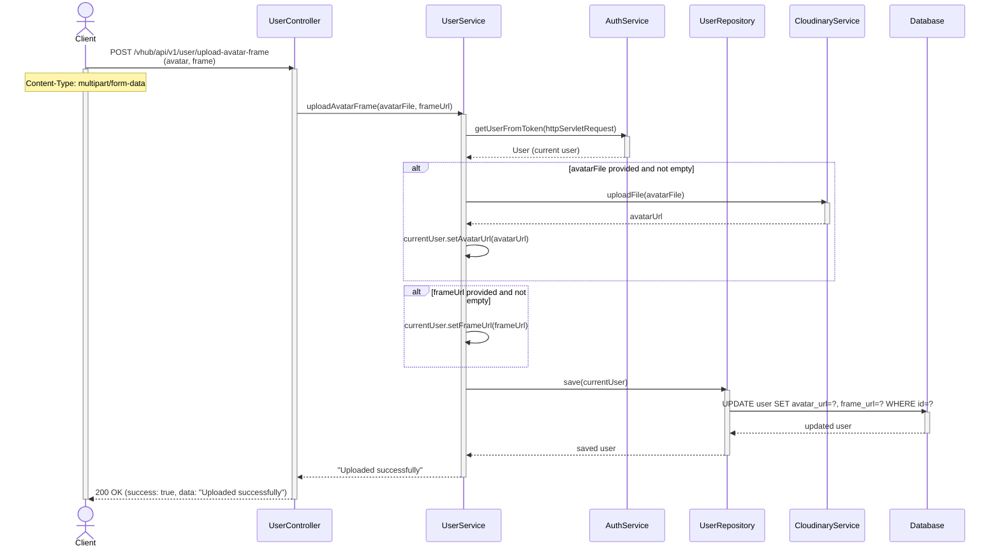
---

## 10. Get All Owned Frames

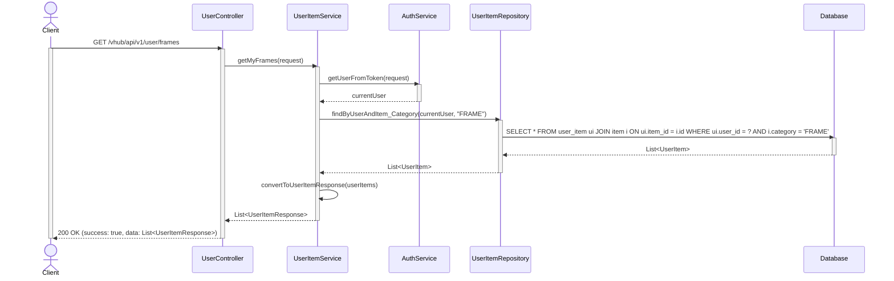

---

## 11. Scheduled Ban Deactivation

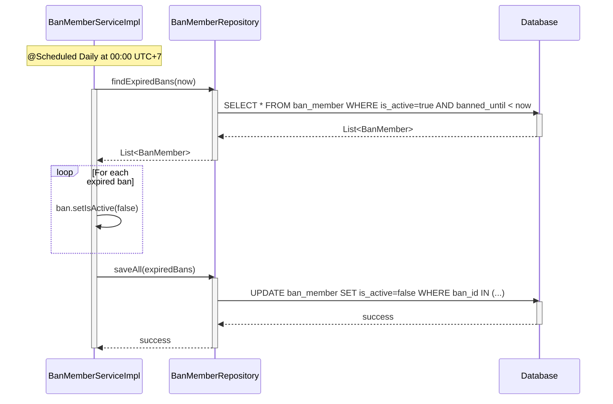

---

## 12. Create FanHub

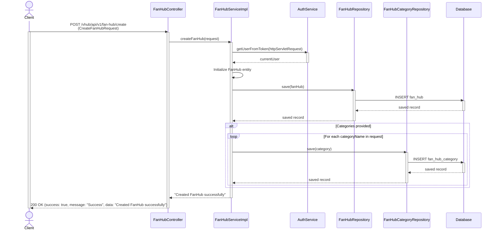

---

## 13. Customize FanHub: Update Details

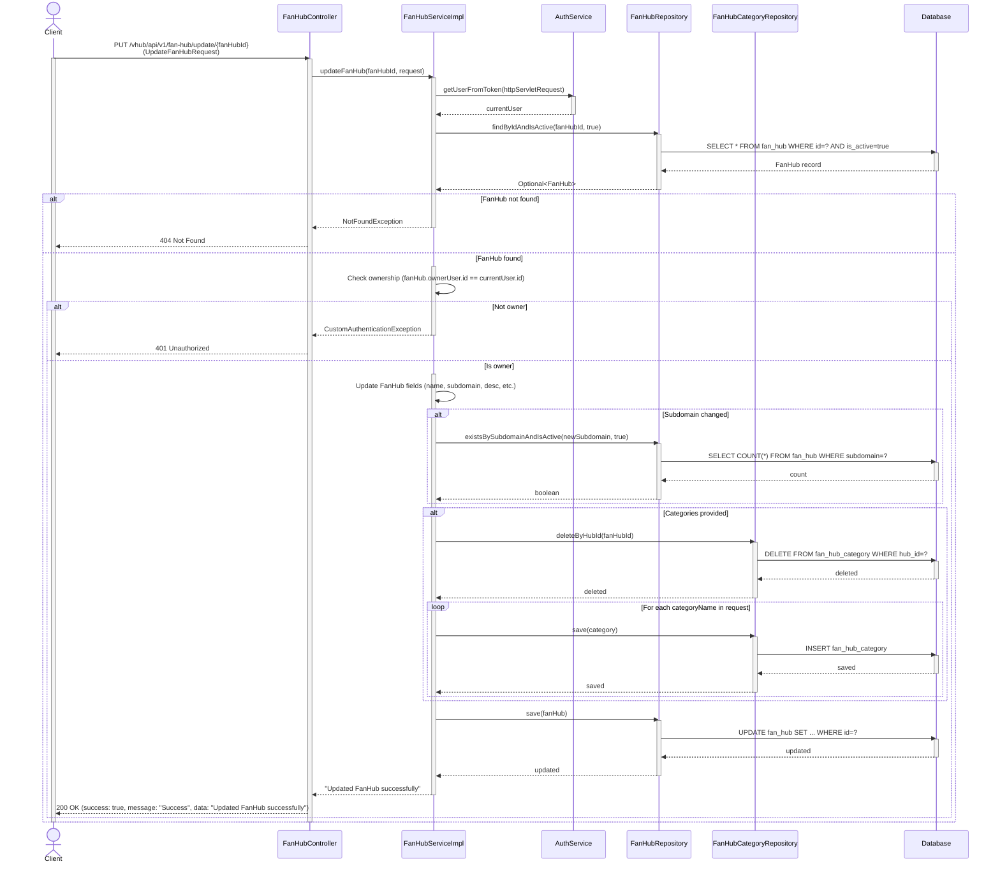

---

## 14. Customize FanHub: Upload Images (Banner, Background, Avatar)

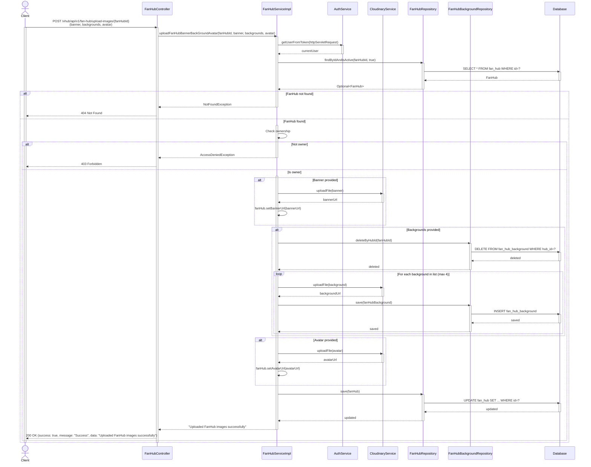

---

## 15. Browse All FanHubs

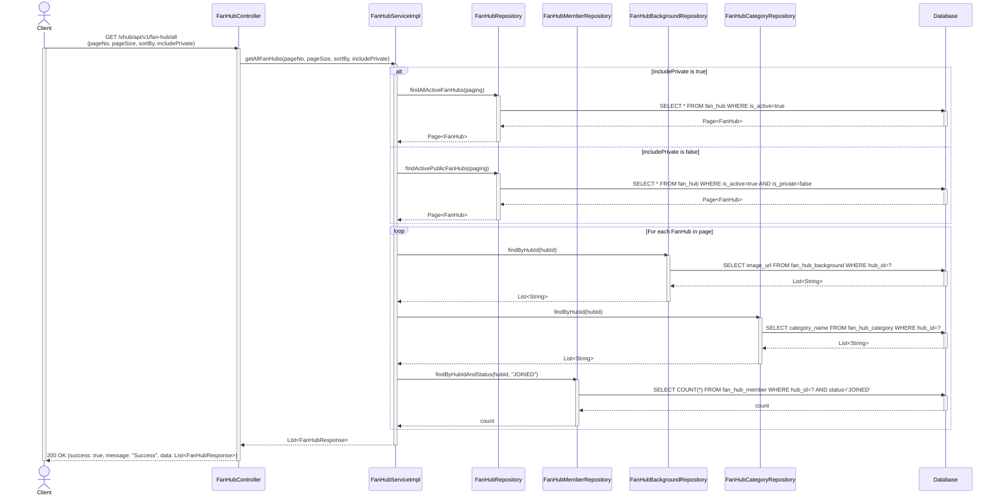

---

## 16. Access FanHub via Subdomain

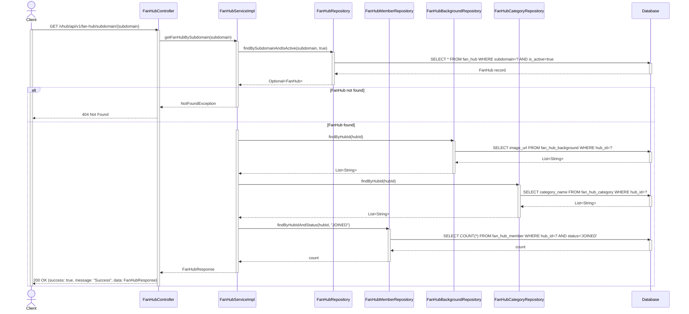

---

## 17. View Joined FanHubs List

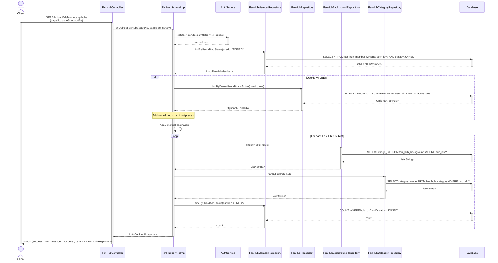

---

## 18. Join FanHub & Membership Request

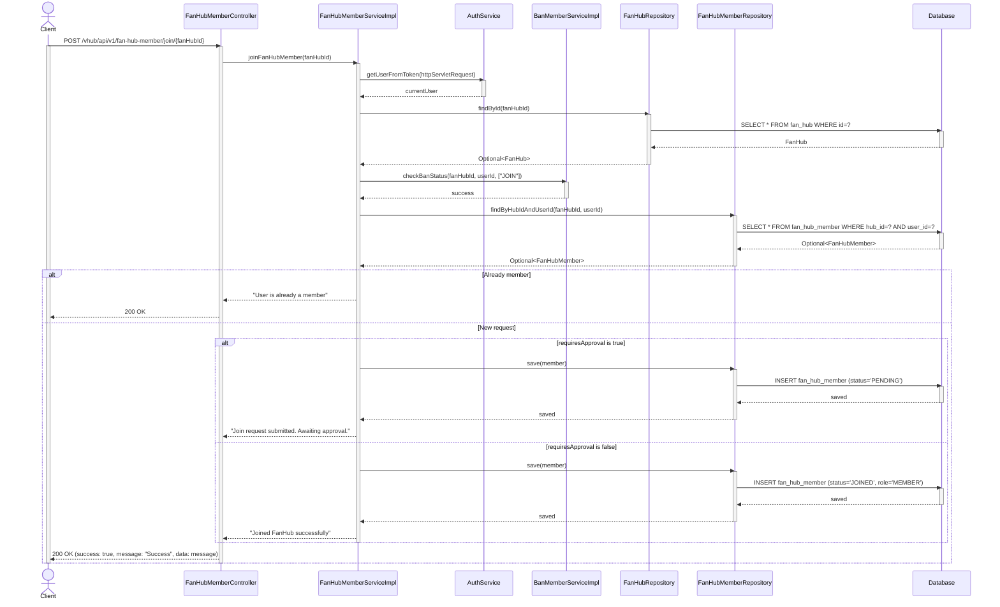

---

## 19. Review Membership

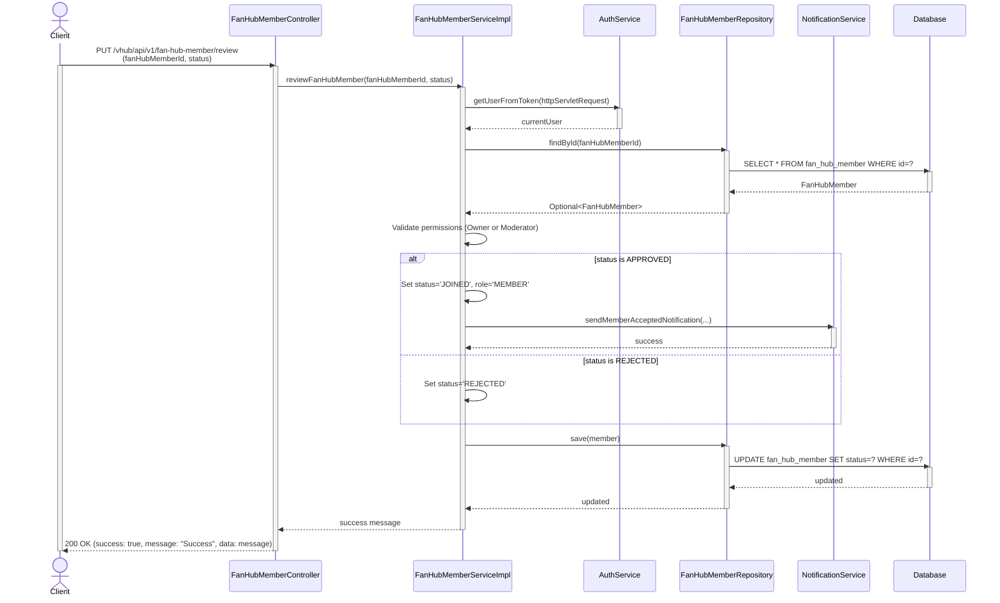

---

## 20. View Member Details

```mermaid
sequenceDiagram
    actor Client
    participant Controller as FanHubMemberController
    participant Service as FanHubMemberServiceImpl
    participant AuthService
    participant MemberRepo as FanHubMemberRepository
    participant FanHubRepo as FanHubRepository
    participant DB as Database

    Client->>Controller: GET /vhub/api/v1/fan-hub-member/members/{fanHubMemberId}/detail
    activate Client
    activate Controller
    
    Controller->>Service: getMemberDetail(fanHubMemberId)
    activate Service
    
    Service->>AuthService: getUserFromToken(httpServletRequest)
    activate AuthService
    AuthService-->>Service: currentUser
    deactivate AuthService
    
    Service->>MemberRepo: findById(fanHubMemberId)
    activate MemberRepo
    MemberRepo->>DB: SELECT * FROM fan_hub_member WHERE id=?
    activate DB
    DB-->>MemberRepo: FanHubMember record
    deactivate DB
    MemberRepo-->>Service: Optional<FanHubMember>
    deactivate MemberRepo
    
    alt Member not found
        Service-->>Controller: NotFoundException
        Controller-->>Client: 404 Not Found
    else Member found
        activate Service
        Service->>Service: Verify permissions (Owner or Moderator)
        alt Access Denied
            Service-->>Controller: AccessDeniedException
            deactivate Service
            Controller-->>Client: 403 Forbidden
        else Access Granted
            activate Service
            Service->>Service: Map to MemberDetailResponse (with User details)
            Service-->>Controller: MemberDetailResponse
            deactivate Service
            Controller-->>Client: 200 OK (success: true, message: "Success", data: MemberDetailResponse)
        end
    end
    
    deactivate Controller
    deactivate Client
```

---

## 21. Check Current User Membership Status

```mermaid
sequenceDiagram
    actor Client
    participant Controller as FanHubMemberController
    participant Service as FanHubMemberServiceImpl
    participant AuthService
    participant FanHubRepo as FanHubRepository
    participant MemberRepo as FanHubMemberRepository
    participant DB as Database

    Client->>Controller: GET /vhub/api/v1/fan-hub-member/{fanHubId}/is-member
    activate Client
    activate Controller
    
    Controller->>Service: checkUserMembership(fanHubId)
    activate Service
    
    Service->>AuthService: getUserFromToken(httpServletRequest)
    activate AuthService
    AuthService-->>Service: currentUser
    deactivate AuthService
    
    Service->>FanHubRepo: findById(fanHubId)
    activate FanHubRepo
    FanHubRepo->>DB: SELECT * FROM fan_hub WHERE id=?
    activate DB
    DB-->>FanHubRepo: FanHub
    deactivate DB
    FanHubRepo-->>Service: Optional<FanHub>
    deactivate FanHubRepo
    
    alt User is Owner
        Service-->>Controller: FanHubMembershipResponse (isMember=true, role=VTUBER)
    else Check Member Repo
        Service->>MemberRepo: findByHubIdAndUserId(fanHubId, userId)
        activate MemberRepo
        MemberRepo->>DB: SELECT * FROM fan_hub_member WHERE hub_id=? AND user_id=? AND status='JOINED'
        activate DB
        DB-->>MemberRepo: Optional<FanHubMember>
        deactivate DB
        MemberRepo-->>Service: Optional<FanHubMember>
        deactivate MemberRepo
        Service-->>Controller: FanHubMembershipResponse (isMember, role)
    end
    
    deactivate Service
    Controller-->>Client: 200 OK (success: true, message: "Success", data: FanHubMembershipResponse)
    deactivate Controller
    deactivate Client
```

---

## 22. Role Management (Set/Remove Moderators)

```mermaid
sequenceDiagram
    actor Client
    participant Controller as FanHubMemberController
    participant Service as FanHubMemberServiceImpl
    participant AuthService
    participant MemberRepo as FanHubMemberRepository
    participant DB as Database

    Client->>Controller: POST /vhub/api/v1/fan-hub-member/set-moderator/{fanHubId}<br/>(memberIds)
    activate Client
    activate Controller
    
    Controller->>Service: addModerator(fanHubId, memberIds)
    activate Service
    
    Service->>AuthService: getUserFromToken(httpServletRequest)
    activate AuthService
    AuthService-->>Service: currentUser
    deactivate AuthService
    
    Service->>Service: Verify User is FanHub Owner
    
    loop For each memberId
        Service->>MemberRepo: findById(memberId)
        activate MemberRepo
        MemberRepo->>DB: SELECT * FROM fan_hub_member WHERE id=?
        activate DB
        DB-->>MemberRepo: FanHubMember
        deactivate DB
        MemberRepo-->>Service: Optional<FanHubMember>
        deactivate MemberRepo
        
        Service->>Service: Set roleInHub = 'MODERATOR'
        Service->>MemberRepo: save(member)
        activate MemberRepo
        MemberRepo->>DB: UPDATE fan_hub_member SET role_in_hub='MODERATOR'
        activate DB
        DB-->>MemberRepo: updated
        deactivate DB
        MemberRepo-->>Service: updated
        deactivate MemberRepo
    end
    
    Service-->>Controller: "Set moderator successfully"
    deactivate Service
    Controller-->>Client: 200 OK (success: true, message: "Success", data: message)
    deactivate Controller
    deactivate Client
```

---

## 23. Member Reporting

```mermaid
sequenceDiagram
    actor Client
    participant Controller as FanHubMemberController
    participant Service as ReportMemberServiceImpl
    participant AuthService
    participant MemberRepo as FanHubMemberRepository
    participant ReportRepo as ReportMemberRepository
    participant CommentRepo as PostCommentRepository
    participant DB as Database

    Client->>Controller: POST /vhub/api/v1/fan-hub-member/report<br/>(CreateReportMemberRequest)
    activate Client
    activate Controller
    
    Controller->>Service: createReportMember(request)
    activate Service
    
    Service->>AuthService: getUserFromToken(httpServletRequest)
    activate AuthService
    AuthService-->>Service: currentUser
    deactivate AuthService
    
    Service->>MemberRepo: findById(memberId)
    activate MemberRepo
    MemberRepo->>DB: SELECT * FROM fan_hub_member WHERE id=?
    activate DB
    DB-->>MemberRepo: FanHubMember
    deactivate DB
    MemberRepo-->>Service: Optional<FanHubMember>
    deactivate MemberRepo
    
    alt Related comment provided
        Service->>CommentRepo: findById(commentId)
        activate CommentRepo
        CommentRepo->>DB: SELECT * FROM post_comment WHERE id=?
        activate DB
        DB-->>CommentRepo: PostComment
        deactivate DB
        CommentRepo-->>Service: Optional<PostComment>
        deactivate CommentRepo
    end
    
    Service->>ReportRepo: save(reportMember)
    activate ReportRepo
    ReportRepo->>DB: INSERT report_member (status='PENDING')
    activate DB
    DB-->>ReportRepo: saved
    deactivate DB
    ReportRepo-->>Service: saved
    deactivate ReportRepo

    Service-->>Controller: "Report member sent successfully"
    deactivate Service
    Controller-->>Client: 200 OK (success: true, message: "Success", data: "Report member sent successfully")
    deactivate Controller
    deactivate Client
```

---

## 24. Ban System

```mermaid
sequenceDiagram
    actor Client
    participant Controller as FanHubMemberController
    participant BanService as BanMemberServiceImpl
    participant AuthService
    participant MemberRepo as FanHubMemberRepository
    participant BanRepo as BanMemberRepository
    participant NotifyService as NotificationService
    participant DB as Database

    Client->>Controller: POST /vhub/api/v1/fan-hub-member/ban<br/>(CreateBanMemberRequest)
    activate Client
    activate Controller
    
    Controller->>BanService: banFanHubMember(request)
    activate BanService
    
    BanService->>AuthService: getUserFromToken(httpServletRequest)
    activate AuthService
    AuthService-->>BanService: currentUser
    deactivate AuthService
    
    BanService->>MemberRepo: findById(fanHubMemberId)
    activate MemberRepo
    MemberRepo->>DB: SELECT * FROM fan_hub_member WHERE id=?
    activate DB
    DB-->>MemberRepo: FanHubMember
    deactivate DB
    MemberRepo-->>BanService: Optional<FanHubMember>
    deactivate MemberRepo
    
    BanService->>BanService: Verify permissions (Owner or Moderator)
    
    BanService->>BanRepo: save(banMember)
    activate BanRepo
    BanRepo->>DB: INSERT ban_member
    activate DB
    DB-->>BanRepo: saved
    deactivate DB
    BanRepo-->>BanService: saved
    deactivate BanRepo
    
    BanService->>NotifyService: sendMemberBannedNotification(...)
    activate NotifyService
    NotifyService-->>BanService: success
    deactivate NotifyService
    
    BanService-->>Controller: "Member banned successfully"
    deactivate BanService
    Controller-->>Client: 200 OK (success: true, message: "Success", data: message)
    deactivate Controller
    deactivate Client
```

---

## 25. Revoke Ban

```mermaid
sequenceDiagram
    actor Client
    participant Controller as FanHubMemberController
    participant BanService as BanMemberServiceImpl
    participant AuthService
    participant BanRepo as BanMemberRepository
    participant DB as Database

    Client->>Controller: PUT /vhub/api/v1/fan-hub-member/ban/revoke?banId={id}
    activate Client
    activate Controller
    
    Controller->>BanService: revokeBan(banId)
    activate BanService
    
    BanService->>AuthService: getUserFromToken(httpServletRequest)
    activate AuthService
    AuthService-->>BanService: currentUser
    deactivate AuthService
    
    BanService->>BanRepo: findById(banId)
    activate BanRepo
    BanRepo->>DB: SELECT * FROM ban_member WHERE id=?
    activate DB
    DB-->>BanRepo: BanMember
    deactivate DB
    BanRepo-->>BanService: Optional<BanMember>
    deactivate BanRepo
    
    BanService->>BanService: Verify permissions (Owner or Moderator)
    
    BanService->>BanService: Set isActive = false
    
    BanService->>BanRepo: save(banMember)
    activate BanRepo
    BanRepo->>DB: UPDATE ban_member SET is_active=false WHERE id=?
    activate DB
    DB-->>BanRepo: updated
    deactivate DB
    BanRepo-->>BanService: updated
    deactivate BanRepo
    
    BanService-->>Controller: "Ban revoked successfully"
    deactivate BanService
    Controller-->>Client: 200 OK (success: true, message: "Success", data: message)
    deactivate Controller
    deactivate Client
```

---

## 26. Resolve Reports

```mermaid
sequenceDiagram
    actor Client
    participant Controller as FanHubMemberController
    participant Service as ReportMemberServiceImpl
    participant AuthService
    participant ReportRepo as ReportMemberRepository
    participant NotifyService as NotificationService
    participant DB as Database

    Client->>Controller: PUT /vhub/api/v1/fan-hub-member/report/resolve<br/>(reportId, resolveMessage)
    activate Client
    activate Controller
    
    Controller->>Service: resolveReportMember(reportId, resolveMessage)
    activate Service
    
    Service->>AuthService: getUserFromToken(httpServletRequest)
    activate AuthService
    AuthService-->>Service: currentUser
    deactivate AuthService
    
    Service->>ReportRepo: findById(reportId)
    activate ReportRepo
    ReportRepo->>DB: SELECT * FROM report_member WHERE id=?
    activate DB
    DB-->>ReportRepo: ReportMember
    deactivate DB
    ReportRepo-->>Service: Optional<ReportMember>
    deactivate ReportRepo
    
    Service->>Service: Verify permissions (Owner or Moderator)
    Service->>Service: Check if resolving own report
    
    Service->>Service: Set status = 'RESOLVED'
    
    Service->>ReportRepo: save(reportMember)
    activate ReportRepo
    ReportRepo->>DB: UPDATE report_member SET status='RESOLVED' WHERE id=?
    activate DB
    DB-->>ReportRepo: updated
    deactivate DB
    ReportRepo-->>Service: updated
    deactivate ReportRepo
    
    Service->>NotifyService: sendReportMemberResolvedNotification(...)
    activate NotifyService
    NotifyService-->>Service: success
    deactivate NotifyService

    Service-->>Controller: "Report resolved successfully"
    deactivate Service
    Controller-->>Client: 200 OK (success: true, message: "Success", data: "Report resolved successfully")
    deactivate Controller
    deactivate Client
```

---

## 27. Kick Member Out Of Fan Hub

```mermaid
sequenceDiagram
    actor Client
    participant Controller as FanHubMemberController
    participant Service as FanHubMemberServiceImpl
    participant AuthService
    participant MemberRepo as FanHubMemberRepository
    participant DB as Database

    Client->>Controller: PUT /vhub/api/v1/fan-hub-member/{fanHubId}/kick/{memberId}
    activate Client
    activate Controller
    
    Controller->>Service: kickMember(fanHubId, memberId)
    activate Service
    
    Service->>AuthService: getUserFromToken(httpServletRequest)
    activate AuthService
    AuthService-->>Service: currentUser
    deactivate AuthService
    
    Service->>Service: Verify permissions (Owner or Moderator)
    Service->>Service: Verify target is simple 'MEMBER'
    
    Service->>MemberRepo: findById(memberId)
    activate MemberRepo
    MemberRepo->>DB: SELECT * FROM fan_hub_member WHERE id=?
    activate DB
    DB-->>MemberRepo: FanHubMember
    deactivate DB
    MemberRepo-->>Service: Optional<FanHubMember>
    deactivate MemberRepo
    
    Service->>MemberRepo: delete(target)
    activate MemberRepo
    MemberRepo->>DB: DELETE FROM fan_hub_member WHERE id=?
    activate DB
    DB-->>MemberRepo: deleted
    deactivate DB
    MemberRepo-->>Service: deleted
    deactivate MemberRepo
    
    Service-->>Controller: "Member kicked successfully"
    deactivate Service
    Controller-->>Client: 200 OK (success: true, data: message)
    deactivate Controller
    deactivate Client
```

---

## 28. Leave Fan Hub

```mermaid
sequenceDiagram
    actor Client
    participant Controller as FanHubMemberController
    participant Service as FanHubMemberServiceImpl
    participant AuthService
    participant MemberRepo as FanHubMemberRepository
    participant DB as Database

    Client->>Controller: PUT /vhub/api/v1/fan-hub-member/{fanHubId}/leave
    activate Client
    activate Controller
    
    Controller->>Service: leaveFanHub(fanHubId)
    activate Service
    
    Service->>AuthService: getUserFromToken(httpServletRequest)
    activate AuthService
    AuthService-->>Service: currentUser
    deactivate AuthService
    
    Service->>Service: Check if User is NOT the Owner
    
    Service->>MemberRepo: findByHubIdAndUserId(fanHubId, userId)
    activate MemberRepo
    MemberRepo->>DB: SELECT * FROM fan_hub_member WHERE hub_id=? AND user_id=? AND status='JOINED'
    activate DB
    DB-->>MemberRepo: FanHubMember
    deactivate DB
    MemberRepo-->>Service: Optional<FanHubMember>
    deactivate MemberRepo
    
    Service->>MemberRepo: delete(member)
    activate MemberRepo
    MemberRepo->>DB: DELETE FROM fan_hub_member WHERE id=?
    activate DB
    DB-->>MemberRepo: deleted
    deactivate DB
    MemberRepo-->>Service: deleted
    deactivate MemberRepo
    
    Service-->>Controller: "Left FanHub successfully"
    deactivate Service
    Controller-->>Client: 200 OK (success: true, message: "Success", data: message)
    deactivate Controller
    deactivate Client
```

---

## 29. Create Post

```mermaid
sequenceDiagram
    actor Client
    participant Controller as PostController
    participant Service as PostServiceImpl
    participant AuthService
    participant BanService as BanMemberServiceImpl
    participant Cloudinary as CloudinaryService
    participant PostRepo as PostRepository
    participant MediaRepo as PostMediaRepository
    participant EventPublisher as ApplicationEventPublisher
    participant DB as Database

    Client->>Controller: POST /vhub/api/v1/posts<br/>(CreatePostRequest, images, video)
    activate Client
    activate Controller
    
    Controller->>Service: createPost(request, images, video)
    activate Service
    
    Service->>AuthService: getUserFromToken(httpServletRequest)
    activate AuthService
    AuthService-->>Service: currentUser
    deactivate AuthService
    
    Service->>BanService: checkBanStatus(hubId, userId, ["POST"])
    activate BanService
    BanService-->>Service: success
    deactivate BanService
    
    Service->>Service: Validate permissions and post type
    
    alt Media provided
        loop For each image/video
            Service->>Cloudinary: uploadFile / uploadVideo
            activate Cloudinary
            Cloudinary-->>Service: mediaUrl
            deactivate Cloudinary
        end
    end
    
    Service->>PostRepo: save(post)
    activate PostRepo
    PostRepo->>DB: INSERT post (status='PENDING' or 'APPROVED')
    activate DB
    DB-->>PostRepo: saved post
    deactivate DB
    PostRepo-->>Service: saved post
    deactivate PostRepo
    
    alt Has media
        Service->>MediaRepo: save(postMedia)
        activate MediaRepo
        MediaRepo->>DB: INSERT post_media
        activate DB
        DB-->>MediaRepo: saved
        deactivate DB
        MediaRepo-->>Service: saved
        deactivate MediaRepo
    end
    
    Service->>EventPublisher: publishEvent(PostCreatedEvent)
    
    Service-->>Controller: "Created post successfully"
    deactivate Service
    
    Controller-->>Client: 200 OK (success: true, message: "Post created successfully")
    deactivate Controller
    deactivate Client
```

---

## 30. Post Moderation (Review Post)

```mermaid
sequenceDiagram
    actor Client
    participant Controller as PostController
    participant Service as PostServiceImpl
    participant AuthService
    participant PostRepo as PostRepository
    participant UserRepo as UserRepository
    participant MemberRepo as FanHubMemberRepository
    participant DB as Database

    Client->>Controller: PUT /vhub/api/v1/posts/review<br/>(postId, status)
    activate Client
    activate Controller
    
    Controller->>Service: reviewPost(postId, status)
    activate Service
    
    Service->>AuthService: getUserFromToken(httpServletRequest)
    activate AuthService
    AuthService-->>Service: currentUser
    deactivate AuthService
    
    Service->>PostRepo: findById(postId)
    activate PostRepo
    PostRepo->>DB: SELECT * FROM post WHERE id=?
    activate DB
    DB-->>PostRepo: Post record
    deactivate DB
    PostRepo-->>Service: Optional<Post>
    deactivate PostRepo
    
    Service->>Service: Verify permissions (Owner or Moderator)
    
    Service->>PostRepo: save(post)
    activate PostRepo
    PostRepo->>DB: UPDATE post SET status=? WHERE id=?
    activate DB
    DB-->>PostRepo: updated
    deactivate DB
    PostRepo-->>Service: updated
    deactivate PostRepo
    
    alt status is APPROVED
        Service->>UserRepo: save(postAuthor)
        activate UserRepo
        UserRepo->>DB: UPDATE user SET points = points + 10
        activate DB
        DB-->>UserRepo: updated
        deactivate DB
        UserRepo-->>Service: updated
        deactivate UserRepo
        
        Service->>MemberRepo: save(fanHubMember)
        activate MemberRepo
        MemberRepo->>DB: UPDATE fan_hub_member SET fan_hub_score = score + 10
        activate DB
        DB-->>MemberRepo: updated
        deactivate DB
        MemberRepo-->>Service: updated
        deactivate MemberRepo
    end
    
    Service-->>Controller: "Post [status] successfully"
    deactivate Service
    Controller-->>Client: 200 OK (success: true, message: "Success")
    deactivate Controller
    deactivate Client
```

---

## 31. Pin/Unpin Posts

```mermaid
sequenceDiagram
    actor Client
    participant Controller as PostController
    participant Service as PostServiceImpl
    participant AuthService
    participant PostRepo as PostRepository
    participant DB as Database

    Client->>Controller: PUT /vhub/api/v1/posts/{postId}/pin (or /unpin)
    activate Client
    activate Controller
    
    Controller->>Service: pinPost(postId) / unpinPost(postId)
    activate Service
    
    Service->>AuthService: getUserFromToken(httpServletRequest)
    activate AuthService
    AuthService-->>Service: currentUser
    deactivate AuthService
    
    Service->>PostRepo: findById(postId)
    activate PostRepo
    PostRepo->>DB: SELECT * FROM post WHERE id=?
    activate DB
    DB-->>PostRepo: Post record
    deactivate DB
    PostRepo-->>Service: Optional<Post>
    deactivate PostRepo
    
    Service->>Service: Verify permissions (Owner or Moderator)
    
    Service->>PostRepo: save(post)
    activate PostRepo
    PostRepo->>DB: UPDATE post SET is_pinned=? WHERE id=?
    activate DB
    DB-->>PostRepo: updated
    deactivate DB
    PostRepo-->>Service: updated
    deactivate PostRepo
    
    Service-->>Controller: "Post [pinned/unpinned] successfully"
    deactivate Service
    Controller-->>Client: 200 OK (success: true, message: "Success")
    deactivate Controller
    deactivate Client
```

---

## 32. AI-Powered Post Validation (Asynchronous)

```mermaid
sequenceDiagram
    participant Listener as PostValidationListener
    participant ValidationService as PostValidationServiceImpl
    participant ContentService as ContentValidationServiceImpl
    participant Groq as GroqAIService
    participant SightEngine as SightEngineService
    participant PostRepo as PostRepository
    participant MediaRepo as PostMediaRepository
    participant DB as Database

    Note over Listener: Triggered by PostCreatedEvent<br/>(AFTER_COMMIT)
    
    Listener->>ValidationService: validatePost(post)
    activate Listener
    activate ValidationService
    
    ValidationService->>ContentService: validateText(postContent)
    activate ContentService
    ContentService->>Groq: sendPrompt(textValidationPrompt)
    activate Groq
    Groq-->>ContentService: "comment@status"
    deactivate Groq
    ContentService-->>ValidationService: "comment@status"
    deactivate ContentService
    
    loop For each post media
        ValidationService->>ContentService: validateImageUrl(mediaUrl)
        activate ContentService
        ContentService->>SightEngine: checkMediaUrl(url)
        activate SightEngine
        SightEngine-->>ContentService: mediaValidationResult
        deactivate SightEngine
        ContentService->>Groq: sendPrompt(mediaReviewPrompt)
        activate Groq
        Groq-->>ContentService: "comment@status"
        deactivate Groq
        ContentService-->>ValidationService: "comment@status"
        deactivate ContentService
        
        ValidationService->>MediaRepo: save(media)
        activate MediaRepo
        MediaRepo->>DB: UPDATE post_media SET ai_validation_status=?, ai_validation_comment=?
        activate DB
        DB-->>MediaRepo: updated
        deactivate DB
        deactivate MediaRepo
    end
    
    ValidationService->>PostRepo: save(post)
    activate PostRepo
    PostRepo->>DB: UPDATE post SET ai_validation_status=?, ai_validation_comment=?
    activate DB
    DB-->>PostRepo: updated
    deactivate DB
    deactivate PostRepo
    
    deactivate ValidationService
    deactivate Listener
```

---

## 33. AI Post Translation

```mermaid
sequenceDiagram
    actor Client
    participant Controller as PostController
    participant Service as PostServiceImpl
    participant AuthService
    participant Gemini as GeminiAIServiceImpl
    participant PostRepo as PostRepository
    participant DB as Database

    Client->>Controller: GET /vhub/api/v1/posts/translate?postId={id}
    activate Client
    activate Controller
    
    Controller->>Service: translatePost(postId)
    activate Service
    
    Service->>PostRepo: findById(postId)
    activate PostRepo
    PostRepo->>DB: SELECT * FROM post WHERE id=?
    activate DB
    DB-->>PostRepo: Post record
    deactivate DB
    PostRepo-->>Service: Optional<Post>
    deactivate PostRepo
    
    Service->>AuthService: getUserFromToken (optional)
    activate AuthService
    AuthService-->>Service: currentUser (may be null)
    deactivate AuthService
    
    alt User is logged in and has preferred language
        Note over Service: Use user.translateLanguage
    else Unauthenticated or no preference
        Note over Service: Use "English" as default
    end
    
    Service->>Gemini: translatePost(content, title, targetLanguage)
    activate Gemini
    Gemini-->>Service: "translatedTitle@translatedContent"
    deactivate Gemini
    
    Service-->>Controller: TranslatePostResponse
    deactivate Service
    Controller-->>Client: 200 OK (success: true, data: TranslatePostResponse)
    deactivate Controller
    deactivate Client
```

---

## 34. AI Post Summarization

```mermaid
sequenceDiagram
    actor Client
    participant Controller as PostController
    participant Service as PostServiceImpl
    participant AuthService
    participant Gemini as GeminiAIServiceImpl
    participant PostRepo as PostRepository
    participant DB as Database

    Client->>Controller: GET /vhub/api/v1/posts/summarize?postId={id}
    activate Client
    activate Controller
    
    Controller->>Service: summarizePost(postId)
    activate Service
    
    Service->>PostRepo: findById(postId)
    activate PostRepo
    PostRepo->>DB: SELECT * FROM post WHERE id=?
    activate DB
    DB-->>PostRepo: Post record
    deactivate DB
    PostRepo-->>Service: Optional<Post>
    deactivate PostRepo
    
    Service->>AuthService: getUserFromToken (optional)
    activate AuthService
    AuthService-->>Service: currentUser (may be null)
    deactivate AuthService
    
    alt User is logged in and has preferred language
        Note over Service: Use user.translateLanguage
    else Unauthenticated or no preference
        Note over Service: Use "English" as default
    end
    
    Service->>Gemini: summarizePost(content, title, targetLanguage)
    activate Gemini
    Gemini-->>Service: summarizeResult
    deactivate Gemini
    
    Service-->>Controller: SummarizePostResponse
    deactivate Service
    Controller-->>Client: 200 OK (success: true, data: SummarizePostResponse)
    deactivate Controller
    deactivate Client
```

---

## 35. Like Post

```mermaid
sequenceDiagram
    actor Client
    participant Controller as PostController
    participant Service as PostServiceImpl
    participant AuthService
    participant BanService as BanMemberServiceImpl
    participant LikeRepo as PostLikeRepository
    participant TrackService as UserTrackService
    participant MissionRepo as UserDailyMissionRepository
    participant NotifyService as NotificationService
    participant DB as Database

    Client->>Controller: POST /vhub/api/v1/posts/like?postId={id}
    activate Client
    activate Controller
    
    Controller->>Service: likePost(postId)
    activate Service
    
    Service->>AuthService: getUserFromToken(httpServletRequest)
    activate AuthService
    AuthService-->>Service: currentUser
    deactivate AuthService
    
    Service->>BanService: checkBanStatus(hubId, userId, ["INTERACT"])
    activate BanService
    BanService-->>Service: success
    deactivate BanService
    
    Service->>LikeRepo: findByUserIdAndPostId(userId, postId)
    activate LikeRepo
    LikeRepo->>DB: SELECT * FROM post_like WHERE user_id=? AND post_id=?
    activate DB
    DB-->>LikeRepo: Optional.empty
    deactivate DB
    LikeRepo-->>Service: Optional.empty
    deactivate LikeRepo
    
    Service->>LikeRepo: save(postLike)
    activate LikeRepo
    LikeRepo->>DB: INSERT post_like
    activate DB
    DB-->>LikeRepo: saved
    deactivate DB
    LikeRepo-->>Service: saved
    deactivate LikeRepo
    
    Service->>TrackService: updateOnLike(currentUser)
    
    Service->>MissionRepo: findById(userId)
    activate MissionRepo
    MissionRepo->>DB: SELECT * FROM user_daily_mission WHERE user_id=?
    activate DB
    DB-->>MissionRepo: mission record
    deactivate DB
    MissionRepo-->>Service: UserDailyMission
    deactivate MissionRepo
    
    Service->>NotifyService: sendPostLikeNotification(...)
    activate NotifyService
    NotifyService-->>Service: success
    deactivate NotifyService
    
    Service-->>Controller: "Post liked successfully!"
    deactivate Service
    Controller-->>Client: 200 OK (success: true, message: "Success", data: "Post liked successfully!")
    deactivate Controller
    deactivate Client
```

---

## 36. Unlike Post

```mermaid
sequenceDiagram
    actor Client
    participant Controller as PostController
    participant Service as PostServiceImpl
    participant AuthService
    participant LikeRepo as PostLikeRepository
    participant DB as Database

    Client->>Controller: POST /vhub/api/v1/posts/unlike?postId={id}
    activate Client
    activate Controller
    
    Controller->>Service: unlikePost(postId)
    activate Service
    
    Service->>AuthService: getUserFromToken(httpServletRequest)
    activate AuthService
    AuthService-->>Service: currentUser
    deactivate AuthService
    
    Service->>LikeRepo: findByUserIdAndPostId(userId, postId)
    activate LikeRepo
    LikeRepo->>DB: SELECT * FROM post_like WHERE user_id=? AND post_id=?
    activate DB
    DB-->>LikeRepo: PostLike record
    deactivate DB
    LikeRepo-->>Service: Optional<PostLike>
    deactivate LikeRepo
    
    Service->>LikeRepo: delete(postLike)
    activate LikeRepo
    LikeRepo->>DB: DELETE FROM post_like WHERE id=?
    activate DB
    DB-->>LikeRepo: deleted
    deactivate DB
    LikeRepo-->>Service: deleted
    deactivate LikeRepo
    
    Service-->>Controller: "Post unliked successfully"
    deactivate Service
    Controller-->>Client: 200 OK (success: true, message: "Success", data: "Post unliked successfully")
    deactivate Controller
    deactivate Client
```

---

## 37. Create Comment or Reply

```mermaid
sequenceDiagram
    actor Client
    participant Controller as PostController
    participant Service as PostCommentServiceImpl
    participant AuthService
    participant BanService as BanMemberServiceImpl
    participant MemberRepo as FanHubMemberRepository
    participant CommentRepo as PostCommentRepository
    participant TrackService as UserTrackService
    participant NotifyService as NotificationService
    participant DB as Database

    Client->>Controller: POST /vhub/api/v1/posts/comment<br/>(CreatePostCommentRequest)
    activate Client
    activate Controller
    
    Controller->>Service: createPostComment(request)
    activate Service
    
    Service->>AuthService: getUserFromToken(httpServletRequest)
    activate AuthService
    AuthService-->>Service: currentUser
    deactivate AuthService
    
    Service->>BanService: checkBanStatus(hubId, userId, ["COMMENT"])
    activate BanService
    BanService-->>Service: success
    deactivate BanService
    
    Service->>MemberRepo: findByHubIdAndUserId(hubId, userId)
    activate MemberRepo
    MemberRepo->>DB: SELECT * FROM fan_hub_member WHERE hub_id=? AND user_id=?
    activate DB
    DB-->>MemberRepo: Optional<FanHubMember>
    deactivate DB
    MemberRepo-->>Service: Optional<FanHubMember>
    deactivate MemberRepo
    
    Service->>CommentRepo: save(postComment)
    activate CommentRepo
    CommentRepo->>DB: INSERT post_comment (parent_comment_id if reply)
    activate DB
    DB-->>CommentRepo: saved
    deactivate DB
    CommentRepo-->>Service: saved
    deactivate CommentRepo
    
    Service->>TrackService: updateOnComment(currentUser)
    
    Service->>NotifyService: sendPostCommentNotification(...)
    activate NotifyService
    NotifyService-->>Service: success
    deactivate NotifyService
    
    Service-->>Controller: true
    deactivate Service
    Controller-->>Client: 200 OK (success: true, message: "Success", data: true)
    deactivate Controller
    deactivate Client
```

---

## 38. Poll Voting

```mermaid
sequenceDiagram
    actor Client
    participant Controller as PostController
    participant Service as PostServiceImpl
    participant AuthService
    participant OptionRepo as VoteOptionRepository
    participant VoteRepo as PostVoteRepository
    participant DB as Database

    Client->>Controller: POST /vhub/api/v1/posts/vote?postId={id}&optionId={optId}
    activate Client
    activate Controller
    
    Controller->>Service: votePost(postId, optionId)
    activate Service
    
    Service->>AuthService: getUserFromToken(httpServletRequest)
    activate AuthService
    AuthService-->>Service: currentUser
    deactivate AuthService
    
    Service->>OptionRepo: findById(optionId)
    activate OptionRepo
    OptionRepo->>DB: SELECT * FROM vote_option WHERE id=?
    activate DB
    DB-->>OptionRepo: VoteOption record
    deactivate DB
    OptionRepo-->>Service: Optional<VoteOption>
    deactivate OptionRepo
    
    Service->>VoteRepo: findByUserIdAndPostId(userId, postId)
    activate VoteRepo
    VoteRepo->>DB: SELECT * FROM post_vote WHERE user_id=? AND post_id=?
    activate DB
    DB-->>VoteRepo: List<PostVote>
    deactivate DB
    VoteRepo-->>Service: List<PostVote>
    deactivate VoteRepo
    
    alt User already voted
        Service->>VoteRepo: save(existingVote)
        activate VoteRepo
        VoteRepo->>DB: UPDATE post_vote SET option_id=?
        activate DB
        DB-->>VoteRepo: updated
        deactivate DB
        VoteRepo-->>Service: updated
        deactivate VoteRepo
        Service-->>Controller: "Vote changed successfully!"
    else First time voting
        Service->>VoteRepo: save(postVote)
        activate VoteRepo
        VoteRepo->>DB: INSERT post_vote
        activate DB
        DB-->>VoteRepo: saved
        deactivate DB
        VoteRepo-->>Service: saved
        deactivate VoteRepo
        Service-->>Controller: "Vote submitted successfully!"
    end
    
    deactivate Service
    Controller-->>Client: 200 OK (success: true, message: "Success", data: message)
    deactivate Controller
    deactivate Client
```

---

## 39. Poll Un-voting

```mermaid
sequenceDiagram
    actor Client
    participant Controller as PostController
    participant Service as PostServiceImpl
    participant AuthService
    participant VoteRepo as PostVoteRepository
    participant DB as Database

    Client->>Controller: POST /vhub/api/v1/posts/un-vote?postId={id}
    activate Client
    activate Controller
    
    Controller->>Service: unVotePost(postId)
    activate Service
    
    Service->>AuthService: getUserFromToken(httpServletRequest)
    activate AuthService
    AuthService-->>Service: currentUser
    deactivate AuthService
    
    Service->>VoteRepo: findByUserIdAndPostId(userId, postId)
    activate VoteRepo
    VoteRepo->>DB: SELECT * FROM post_vote WHERE user_id=? AND post_id=?
    activate DB
    DB-->>VoteRepo: PostVote record
    deactivate DB
    VoteRepo-->>Service: Optional<PostVote>
    deactivate VoteRepo
    
    Service->>VoteRepo: delete(postVote)
    activate VoteRepo
    VoteRepo->>DB: DELETE FROM post_vote WHERE id=?
    activate DB
    DB-->>VoteRepo: deleted
    deactivate DB
    VoteRepo-->>Service: deleted
    deactivate VoteRepo
    
    Service-->>Controller: "Vote removed successfully!"
    deactivate Service
    Controller-->>Client: 200 OK (success: true, message: "Success", data: "Vote removed successfully!")
    deactivate Controller
    deactivate Client
```

---

## 40. Send Gifts with Comments

```mermaid
sequenceDiagram
    actor Client
    participant Controller as PostController
    participant Service as PostCommentServiceImpl
    participant AuthService
    participant UserRepo as UserRepository
    participant GiftRepo as PostCommentGiftRepository
    participant CommentRepo as PostCommentRepository
    participant DB as Database

    Client->>Controller: POST /vhub/api/v1/posts/comment/gift/{commentId}
    activate Client
    activate Controller
    
    Controller->>Service: sendCommentGift(commentId)
    activate Service
    
    Service->>AuthService: getUserFromToken(httpServletRequest)
    activate AuthService
    AuthService-->>Service: sender
    deactivate AuthService
    
    Service->>CommentRepo: findById(commentId)
    activate CommentRepo
    CommentRepo->>DB: SELECT * FROM post_comment WHERE id=?
    activate DB
    DB-->>CommentRepo: Comment record (receiver author)
    deactivate DB
    CommentRepo-->>Service: Optional<PostComment>
    deactivate CommentRepo
    
    Service->>Service: Check sufficient points (requires 2)
    
    Service->>UserRepo: save(sender)
    activate UserRepo
    UserRepo->>DB: UPDATE user SET points = points - 2 WHERE id=senderId
    activate DB
    DB-->>UserRepo: updated
    deactivate DB
    deactivate UserRepo
    
    Service->>GiftRepo: save(postCommentGift)
    activate GiftRepo
    GiftRepo->>DB: INSERT post_comment_gift
    activate DB
    DB-->>GiftRepo: saved
    deactivate DB
    GiftRepo-->>Service: saved
    deactivate GiftRepo
    
    Service->>UserRepo: save(receiver)
    activate UserRepo
    UserRepo->>DB: UPDATE user SET points = points + 2 WHERE id=receiverId
    activate DB
    DB-->>UserRepo: updated
    deactivate DB
    deactivate UserRepo
    
    Service-->>Controller: "Gift sent successfully!"
    deactivate Service
    Controller-->>Client: 200 OK (success: true, message: "Success", data: "Gift sent successfully!")
    deactivate Controller
    deactivate Client
```

---

## 41. Report Post

```mermaid
sequenceDiagram
    actor Client
    participant Controller as PostController
    participant Service as ReportPostServiceImpl
    participant AuthService
    participant PostRepo as PostRepository
    participant ReportRepo as ReportPostRepository
    participant DB as Database

    Client->>Controller: POST /vhub/api/v1/posts/report<br/>(CreateReportPostRequest)
    activate Client
    activate Controller

    Controller->>Service: createReportPost(request)
    activate Service

    Service->>AuthService: getUserFromToken(httpServletRequest)
    activate AuthService
    AuthService-->>Service: currentUser
    deactivate AuthService

    Service->>PostRepo: findById(postId)
    activate PostRepo
    PostRepo->>DB: SELECT * FROM post WHERE id=?
    activate DB
    DB-->>PostRepo: Post record
    deactivate DB
    PostRepo-->>Service: Optional<Post>
    deactivate PostRepo

    alt Post not found
        Service-->>Controller: NotFoundException("Post not found")
        deactivate Service
        Controller-->>Client: 404 Not Found
    else Post found
        Service->>ReportRepo: save(reportPost)
        activate ReportRepo
        ReportRepo->>DB: INSERT report_post (status='PENDING')
        activate DB
        DB-->>ReportRepo: saved
        deactivate DB
        ReportRepo-->>Service: saved
        deactivate ReportRepo

        Service-->>Controller: "Report post sent successfully"
        deactivate Service
        Controller-->>Client: 200 OK (success: true, data: "Report post sent successfully")
    end
    deactivate Controller
    deactivate Client
```
---

## 42. Like Comment

```mermaid
    sequenceDiagram
    actor Client
    participant Controller as PostController
    participant Service as PostCommentServiceImpl
    participant AuthService
    participant LikeRepo as PostCommentLikeRepository
    participant DB as Database

    Client->>Controller: POST /vhub/api/v1/posts/comment/like/{commentId}
    activate Client
    activate Controller

    Controller->>Service: likeComment(commentId)
    activate Service

    Service->>AuthService: getUserFromToken(httpServletRequest)
    activate AuthService
    AuthService-->>Service: currentUser
    deactivate AuthService

    Service->>LikeRepo: findByUserIdAndComment(userId, comment)
    activate LikeRepo
    LikeRepo->>DB: SELECT * FROM post_comment_like WHERE user_id=? AND comment_id=?
    activate DB
    DB-->>LikeRepo: Optional.empty
    deactivate DB
    LikeRepo-->>Service: Optional.empty
    deactivate LikeRepo

    Service->>LikeRepo: save(postCommentLike)
    activate LikeRepo
    LikeRepo->>DB: INSERT post_comment_like
    activate DB
    DB-->>LikeRepo: saved
    deactivate DB
    LikeRepo-->>Service: saved
    deactivate LikeRepo

    Service-->>Controller: "Comment liked successfully!"
    deactivate Service
    Controller-->>Client: 200 OK (success: true, data: "Comment liked successfully!")
    deactivate Controller
    deactivate Client
```
---

## 43. Unlike Comment

    ```mermaid
    sequenceDiagram
    actor Client
    participant Controller as PostController
    participant Service as PostCommentServiceImpl
    participant AuthService
    participant LikeRepo as PostCommentLikeRepository
    participant DB as Database

    Client->>Controller: POST /vhub/api/v1/posts/comment/unlike/{commentId}
    activate Client
    activate Controller

    Controller->>Service: unlikeComment(commentId)
    activate Service

    Service->>AuthService: getUserFromToken(httpServletRequest)
    activate AuthService
    AuthService-->>Service: currentUser
    deactivate AuthService

    Service->>LikeRepo: findByUserIdAndComment(userId, comment)
    activate LikeRepo
    LikeRepo->>DB: SELECT * FROM post_comment_like WHERE user_id=? AND comment_id=?
    activate DB
    DB-->>LikeRepo: PostCommentLike record
    deactivate DB
    LikeRepo-->>Service: Optional<PostCommentLike>
    deactivate LikeRepo

    Service->>LikeRepo: delete(postCommentLike)
    activate LikeRepo
    LikeRepo->>DB: DELETE FROM post_comment_like WHERE id=?
    activate DB
    DB-->>LikeRepo: deleted
    deactivate DB
    LikeRepo-->>Service: deleted
    deactivate LikeRepo

    Service-->>Controller: "Comment unliked successfully."
    deactivate Service
    Controller-->>Client: 200 OK (success: true, data: "Comment unliked successfully.")
    deactivate Controller
    deactivate Client
    ```

    ---

## 44. Edit Comment

    ```mermaid
    sequenceDiagram
    actor Client
    participant Controller as PostController
    participant Service as PostCommentServiceImpl
    participant AuthService
    participant CommentRepo as PostCommentRepository
    participant DB as Database

    Client->>Controller: PUT /vhub/api/v1/posts/comment/{commentId}<br/>(EditPostCommentRequest)
    activate Client
    activate Controller

    Controller->>Service: editComment(commentId, request)
    activate Service

    Service->>AuthService: getUserFromToken(httpServletRequest)
    activate AuthService
    AuthService-->>Service: currentUser
    deactivate AuthService

    Service->>CommentRepo: findById(commentId)
    activate CommentRepo
    CommentRepo->>DB: SELECT * FROM post_comment WHERE id=?
    activate DB
    DB-->>CommentRepo: PostComment record
    deactivate DB
    CommentRepo-->>Service: Optional<PostComment>
    deactivate CommentRepo

    Service->>Service: Verify author is current user

    Service->>CommentRepo: save(comment)
    activate CommentRepo
    CommentRepo->>DB: UPDATE post_comment SET content=? WHERE id=?
    activate DB
    DB-->>CommentRepo: updated
    deactivate DB
    CommentRepo-->>Service: updated
    deactivate CommentRepo

    Service-->>Controller: "Comment edited successfully"
    deactivate Service
    Controller-->>Client: 200 OK (success: true, data: "Comment edited successfully")
    deactivate Controller
    deactivate Client
    ```

    ---

## 45. Delete Comment

    ```mermaid
    sequenceDiagram
    actor Client
    participant Controller as PostController
    participant Service as PostCommentServiceImpl
    participant AuthService
    participant CommentRepo as PostCommentRepository
    participant DB as Database

    Client->>Controller: DELETE /vhub/api/v1/posts/comment/{commentId}
    activate Client
    activate Controller

    Controller->>Service: deleteComment(commentId)
    activate Service

    Service->>AuthService: getUserFromToken(httpServletRequest)
    activate AuthService
    AuthService-->>Service: currentUser
    deactivate AuthService

    Service->>CommentRepo: findById(commentId)
    activate CommentRepo
    CommentRepo->>DB: SELECT * FROM post_comment WHERE id=?
    activate DB
    DB-->>CommentRepo: PostComment record
    deactivate DB
    CommentRepo-->>Service: Optional<PostComment>
    deactivate CommentRepo

    Service->>Service: Verify author is current user

    Service->>CommentRepo: delete(comment)
    activate CommentRepo
    CommentRepo->>DB: DELETE FROM post_comment WHERE id=?
    activate DB
    DB-->>CommentRepo: deleted
    deactivate DB
    CommentRepo-->>Service: deleted
    deactivate CommentRepo

    Service-->>Controller: "Comment deleted successfully"
    deactivate Service
    Controller-->>Client: 200 OK (success: true, data: "Comment deleted successfully")
    deactivate Controller
    deactivate Client
    ```

    ---

## 46. Hide Comment (Moderation)

    ```mermaid
    sequenceDiagram
    actor Client
    participant Controller as PostController
    participant Service as PostCommentServiceImpl
    participant AuthService
    participant MemberRepo as FanHubMemberRepository
    participant CommentRepo as PostCommentRepository
    participant DB as Database

    Client->>Controller: PUT /vhub/api/v1/posts/comment/{commentId}/hide
    activate Client
    activate Controller

    Controller->>Service: hideComment(commentId)
    activate Service

    Service->>AuthService: getUserFromToken(httpServletRequest)
    activate AuthService
    AuthService-->>Service: currentUser
    deactivate AuthService

    Service->>CommentRepo: findById(commentId)
    activate CommentRepo
    CommentRepo->>DB: SELECT * FROM post_comment WHERE id=?
    activate DB
    DB-->>CommentRepo: PostComment record
    deactivate DB
    CommentRepo-->>Service: Optional<PostComment>
    deactivate CommentRepo

    Service->>Service: Verify permissions (Owner or Moderator of the Hub)

    Service->>CommentRepo: save(comment)
    activate CommentRepo
    CommentRepo->>DB: UPDATE post_comment SET status='HIDDEN' WHERE id=?
    activate DB
    DB-->>CommentRepo: updated
    deactivate DB
    CommentRepo-->>Service: updated
    deactivate MemberRepo

    Service-->>Controller: "Comment hidden successfully"
    deactivate Service
    Controller-->>Client: 200 OK (success: true, data: "Comment hidden successfully")
    deactivate Controller
    deactivate Client
    ```

    ---

## 47. Get Personalized Feed

    ```mermaid
    sequenceDiagram
    actor Client
    participant Controller as PostController
    participant Service as PostServiceImpl
    participant AuthService
    participant MemberRepo as FanHubMemberRepository
    participant PostRepo as PostRepository
    participant DB as Database

    Client->>Controller: GET /vhub/api/v1/posts/feed?pageNo=0&pageSize=10
    activate Client
    activate Controller

    Controller->>Service: getPersonalizedFeed(pageNo, pageSize, sortBy)
    activate Service

    Service->>AuthService: getUserFromToken (optional)
    activate AuthService
    AuthService-->>Service: currentUser (may be null)
    deactivate AuthService

    alt Unauthenticated User
        Service->>PostRepo: findPublicPostsOrderByInteractions(paging)
        activate PostRepo
        PostRepo->>DB: SELECT * FROM post WHERE is_private=false...
        activate DB
        DB-->>PostRepo: Page<Post>
        deactivate DB
        PostRepo-->>Service: Page<Post>
        deactivate PostRepo
    else Authenticated User
        Service->>MemberRepo: findAllByUserId(userId)
        activate MemberRepo
        MemberRepo->>DB: SELECT hub_id FROM fan_hub_member WHERE user_id=?
        activate DB
        DB-->>MemberRepo: followedHubIds
        deactivate DB
        MemberRepo-->>Service: List<Long>
        deactivate MemberRepo

        Note over Service: Calculate pageSize ratios:<br/>70% Followed, 30% Suggestions

        Service->>PostRepo: findByHubIdInAndStatusApproved(followedHubIds, ...)
        activate PostRepo
        PostRepo->>DB: SELECT * FROM post WHERE hub_id IN (...)
        activate DB
        DB-->>PostRepo: followedPosts
        deactivate DB
        PostRepo-->>Service: List<Post>
        deactivate PostRepo

        Service->>PostRepo: findPublicPostsByCategories(followedHubIds, followedCategories, ...)
        activate PostRepo
        PostRepo->>DB: SELECT * FROM post p JOIN hub h... (smart suggestion)
        activate DB
        DB-->>PostRepo: suggestionPosts
        deactivate DB
        PostRepo-->>Service: List<Post>
        deactivate PostRepo

        Service->>Service: mergePostsByRatio(followedPosts, suggestionPosts)
    end

    Service-->>Controller: List<PostResponse>
    deactivate Service
    Controller-->>Client: 200 OK (success: true, data: List<PostResponse>)
    deactivate Controller
    deactivate Client
    ```

---

## 48. AI Chatbot: Send Message & Get Response

```mermaid
sequenceDiagram
    actor Client
    participant ChatMsgController as ChatMessageController
    participant ChatMsgService as ChatMessageServiceImpl
    participant AiRespService as AiResponseServiceImpl
    participant GeminiService as GeminiAIService
    participant UserRepo as UserRepository
    participant SessionRepo as ChatSessionRepository
    participant MsgRepo as ChatMessageRepository
    participant PostRepo as PostRepository
    participant MediaRepo as PostMediaRepository
    participant DB as Database

    Client->>ChatMsgController: POST /vhub/api/v1/message<br/>(SendMessageRequest)
    activate Client
    activate ChatMsgController
    
    ChatMsgController->>ChatMsgService: sendMessage(request, username)
    activate ChatMsgService
    
    ChatMsgService->>UserRepo: findByUsernameAndIsActive(username)
    activate UserRepo
    UserRepo->>DB: SELECT * FROM user WHERE username=?
    activate DB
    DB-->>UserRepo: User record
    deactivate DB
    UserRepo-->>ChatMsgService: Optional<User>
    deactivate UserRepo
    
    ChatMsgService->>SessionRepo: findByUser_Id(userId)
    activate SessionRepo
    SessionRepo->>DB: SELECT * FROM chat_session WHERE user_id=?
    activate DB
    DB-->>SessionRepo: ChatSession record
    deactivate DB
    SessionRepo-->>ChatMsgService: Optional<ChatSession>
    deactivate SessionRepo
    
    ChatMsgService->>MsgRepo: save(userChatMessage)
    activate MsgRepo
    MsgRepo->>DB: INSERT chat_message (senderRole='USER')
    activate DB
    DB-->>MsgRepo: saved
    deactivate DB
    MsgRepo-->>ChatMsgService: saved
    deactivate MsgRepo
    
    ChatMsgService->>AiRespService: generateAndSendReply(user, content)
    activate AiRespService
    
    AiRespService->>MsgRepo: findTop20BySession_Id(sessionId)
    activate MsgRepo
    MsgRepo->>DB: SELECT TOP 20 FROM chat_message WHERE session_id=?
    activate DB
    DB-->>MsgRepo: List<ChatMessage>
    deactivate DB
    MsgRepo-->>AiRespService: history
    deactivate MsgRepo
    
    AiRespService->>GeminiService: sendPromptFunctionCalling(prompt, personality, userId)
    activate GeminiService
    Note over GeminiService: Call Gemini API with context<br/>and personality instructions
    GeminiService-->>AiRespService: AIMessageResponse (content, thought, metadata)
    deactivate GeminiService
    
    AiRespService->>MsgRepo: save(aiChatMessage)
    activate MsgRepo
    MsgRepo->>DB: INSERT chat_message (senderRole='AI')
    activate DB
    DB-->>MsgRepo: saved
    deactivate DB
    MsgRepo-->>AiRespService: saved
    deactivate MsgRepo
    
    alt hasMetadata is true
        AiRespService->>PostRepo: findById(metadataTargetId)
        activate PostRepo
        PostRepo->>DB: SELECT * FROM post WHERE id=?
        activate DB
        DB-->>PostRepo: Post record
        deactivate DB
        PostRepo-->>AiRespService: Post
        deactivate PostRepo
        
        AiRespService->>MediaRepo: findByPostId(postId)
        activate MediaRepo
        MediaRepo->>DB: SELECT * FROM post_media WHERE post_id=?
        activate DB
        DB-->>MediaRepo: List<PostMedia>
        deactivate DB
        MediaRepo-->>AiRespService: medias
        deactivate MediaRepo
    end
    
    AiRespService-->>ChatMsgService: MessageResponse
    deactivate AiRespService
    
    ChatMsgService-->>ChatMsgController: MessageResponse
    deactivate ChatMsgService
    
    ChatMsgController-->>Client: 200 OK (success: true, data: MessageResponse)
    deactivate ChatMsgController
    deactivate Client
```

---

## 49. Point Shop: Purchase Item

```mermaid
sequenceDiagram
    actor Client
    participant ShopController as ShopItemController
    participant UserItemService as UserItemServiceImpl
    participant AuthService
    participant ShopRepo as ShopItemRepository
    participant UserRepo as UserRepository
    participant UserItemRepo as UserItemRepository
    participant PaymentRepo as PaymentHistoryRepository
    participant DB as Database

    Client->>ShopController: POST /vhub/api/v1/shop-items/purchase<br/>(PurchaseItemRequest)
    activate Client
    activate ShopController
    
    ShopController->>UserItemService: purchaseItem(request, httpRequest)
    activate UserItemService
    
    UserItemService->>AuthService: getUserFromToken(httpRequest)
    activate AuthService
    AuthService-->>UserItemService: currentUser
    deactivate AuthService
    
    UserItemService->>ShopRepo: findById(shopItemId)
    activate ShopRepo
    ShopRepo->>DB: SELECT * FROM shop_item WHERE id=?
    activate DB
    DB-->>ShopRepo: ShopItem record
    deactivate DB
    ShopRepo-->>UserItemService: ShopItem
    deactivate ShopRepo
    
    alt Insufficient Points
        Note over UserItemService: Check user.points < shopItem.price
        UserItemService-->>ShopController: IllegalStateException("Insufficient points")
        ShopController-->>Client: 400 Bad Request
    else Sufficient Points
        UserItemService->>UserRepo: save(user)
        activate UserRepo
        UserRepo->>DB: UPDATE user SET points = points - price
        activate DB
        DB-->>UserRepo: updated
        deactivate DB
        UserRepo-->>UserItemService: updated
        deactivate UserRepo
        
        UserItemService->>UserItemRepo: save(userItem)
        activate UserItemRepo
        UserItemRepo->>DB: INSERT user_item
        activate DB
        DB-->>UserItemRepo: saved
        deactivate DB
        UserItemRepo-->>UserItemService: saved
        deactivate UserItemRepo
        
        UserItemService->>PaymentRepo: save(paymentHistory)
        activate PaymentRepo
        PaymentRepo->>DB: INSERT payment_history
        activate DB
        DB-->>PaymentRepo: saved
        deactivate DB
        PaymentRepo-->>UserItemService: saved
        deactivate PaymentRepo
        
        UserItemService-->>ShopController: PurchaseResponse
        deactivate UserItemService
        ShopController-->>Client: 200 OK (success: true, data: PurchaseResponse)
    end
    
    deactivate ShopController
    deactivate Client
```

---

## 50. Gacha: Pull from Banner

```mermaid
sequenceDiagram
    actor Client
    participant BannerController
    participant BannerItemService as BannerItemServiceImpl
    participant AuthService
    participant BannerRepo as BannerRepository
    participant BannerItemRepo as BannerItemRepository
    participant UserRepo as UserRepository
    participant UserItemRepo as UserItemRepository
    participant DB as Database

    Client->>BannerController: POST /vhub/api/v1/banners/gacha<br/>(GachaBannerItemRequest)
    activate Client
    activate BannerController
    
    BannerController->>BannerItemService: gachaBannerItem(request, httpRequest)
    activate BannerItemService
    
    BannerItemService->>AuthService: getUserFromToken(httpRequest)
    activate AuthService
    AuthService-->>BannerItemService: currentUser
    deactivate AuthService
    
    BannerItemService->>BannerRepo: findById(bannerId)
    activate BannerRepo
    BannerRepo->>DB: SELECT * FROM banner WHERE id=?
    activate DB
    DB-->>BannerRepo: Banner record
    deactivate DB
    BannerRepo-->>BannerItemService: Banner
    deactivate BannerRepo
    
    Note over BannerItemService: Check if banner is active & user has points
    
    BannerItemService->>UserRepo: save(user)
    activate UserRepo
    UserRepo->>DB: UPDATE user SET points = points - gachaCost
    activate DB
    DB-->>UserRepo: updated
    deactivate DB
    UserRepo-->>BannerItemService: updated
    deactivate UserRepo
    
    BannerItemService->>BannerItemRepo: findByBannerId(bannerId, unpaged)
    activate BannerItemRepo
    BannerItemRepo->>DB: SELECT * FROM banner_item WHERE banner_id=?
    activate DB
    DB-->>BannerItemRepo: List<BannerItem>
    deactivate DB
    BannerItemRepo-->>BannerItemService: bannerItems
    deactivate BannerItemRepo
    
    Note over BannerItemService: performWeightedRandomSelection(bannerItems)
    
    alt type is GOOD_LUCK
        BannerItemService->>UserRepo: save(user)
        activate UserRepo
        UserRepo->>DB: UPDATE user SET points = points - gachaCost
        activate DB
        DB-->>UserRepo: success
        deactivate DB
        UserRepo-->>BannerItemService: updated
        deactivate UserRepo
        BannerItemService-->>BannerController: GachaResultResponse (No item)
    else item is Duplicate
        BannerItemService->>UserItemRepo: existsByUserAndItem(user, selectedItem)
        activate UserItemRepo
        UserItemRepo->>DB: SELECT COUNT(*) FROM user_item WHERE user_id=? AND item_id=?
        activate DB
        DB-->>UserItemRepo: exists
        deactivate DB
        UserItemRepo-->>BannerItemService: true
        deactivate UserItemRepo

        BannerItemService->>UserRepo: save(user)
        activate UserRepo
        UserRepo->>DB: UPDATE user SET points = points - gachaCost + refundAmount
        activate DB
        DB-->>UserRepo: updated
        deactivate DB
        UserRepo-->>BannerItemService: updated
        deactivate UserRepo
        BannerItemService-->>BannerController: GachaResultResponse (Duplicate info, pointsRefunded)
    else item is New
        BannerItemService->>UserRepo: save(user)
        activate UserRepo
        UserRepo->>DB: UPDATE user SET points = points - gachaCost
        activate DB
        DB-->>UserRepo: updated
        deactivate DB
        UserRepo-->>BannerItemService: updated
        deactivate UserRepo

        BannerItemService->>UserItemRepo: save(userItem)
        activate UserItemRepo
        UserItemRepo->>DB: INSERT user_item
        activate DB
        DB-->>UserItemRepo: saved
        deactivate DB
        UserItemRepo-->>BannerItemService: saved
        deactivate UserItemRepo
        BannerItemService-->>BannerController: GachaResultResponse (Item info)
    end
    
    deactivate BannerItemService
    BannerController-->>Client: 200 OK (success: true, data: GachaResultResponse)
    deactivate BannerController
    deactivate Client
```

---

## 51. Feedback: Submit

```mermaid
sequenceDiagram
    actor Client
    participant FeedbackController
    participant FeedbackService as FeedbackServiceImpl
    participant AuthService
    participant FeedbackRepo as UserFeedbackRepository
    participant CategoryRepo as FeedbackCategoryRepository
    participant DB as Database

    Client->>FeedbackController: POST /vhub/api/v1/feedback/submit<br/>(CreateFeedbackRequest)
    activate Client
    activate FeedbackController

    FeedbackController->>FeedbackService: submitFeedback(request)
    activate FeedbackService

    FeedbackService->>AuthService: getUserFromToken(httpRequest)
    activate AuthService
    AuthService-->>FeedbackService: currentUser
    deactivate AuthService

    FeedbackService->>CategoryRepo: findById(categoryId)
    activate CategoryRepo
    CategoryRepo->>DB: SELECT * FROM feedback_category WHERE id=?
    activate DB
    DB-->>CategoryRepo: FeedbackCategory
    deactivate DB
    CategoryRepo-->>FeedbackService: Category
    deactivate CategoryRepo

    FeedbackService->>FeedbackRepo: save(feedback)
    activate FeedbackRepo
    FeedbackRepo->>DB: INSERT user_feedback
    activate DB
    DB-->>FeedbackRepo: saved
    deactivate DB
    FeedbackRepo-->>FeedbackService: saved
    deactivate FeedbackRepo

    FeedbackService-->>FeedbackController: "Feedback submitted successfully"
    deactivate FeedbackService
    FeedbackController-->>Client: 200 OK
    deactivate FeedbackController
    deactivate Client
```

---

## 52. Feedback: View All (Admin)

```mermaid
sequenceDiagram
    actor Client
    participant FeedbackController
    participant FeedbackService as FeedbackServiceImpl
    participant FeedbackRepo as UserFeedbackRepository
    participant DB as Database

    Client->>FeedbackController: GET /vhub/api/v1/feedback/all
    activate Client
    activate FeedbackController

    FeedbackController->>FeedbackService: getAllFeedback(page, size, sortBy)
    activate FeedbackService

    FeedbackService->>FeedbackRepo: findAll(paging)
    activate FeedbackRepo
    FeedbackRepo->>DB: SELECT * FROM user_feedback
    activate DB
    DB-->>FeedbackRepo: Page<UserFeedback>
    deactivate DB
    FeedbackRepo-->>FeedbackService: Page<UserFeedback>
    deactivate FeedbackRepo

    FeedbackService-->>FeedbackController: List<FeedbackResponse>
    deactivate FeedbackService
    FeedbackController-->>Client: 200 OK (success: true, data: List<FeedbackResponse>)
    deactivate FeedbackController
    deactivate Client
```

---

## 53. FanHub Report: Create

```mermaid
sequenceDiagram
    actor Client
    participant ReportController as FanHubReportController
    participant ReportService as FanHubReportServiceImpl
    participant AuthService
    participant ReportRepo as FanHubReportRepository
    participant DB as Database

    Client->>ReportController: POST /vhub/api/v1/fan-hub-report/create<br/>(CreateFanHubReportRequest)
    activate Client
    activate ReportController

    ReportController->>ReportService: createFanHubReport(request)
    activate ReportService

    ReportService->>AuthService: getUserFromToken(httpRequest)
    activate AuthService
    AuthService-->>ReportService: currentUser
    deactivate AuthService

    ReportService->>ReportRepo: save(fanHubReport)
    activate ReportRepo
    ReportRepo->>DB: INSERT fan_hub_report (status='PENDING')
    activate DB
    DB-->>ReportRepo: saved
    deactivate DB
    ReportRepo-->>ReportService: saved
    deactivate ReportRepo

    ReportService-->>ReportController: "Created FanHub report successfully"
    deactivate ReportService
    ReportController-->>Client: 200 OK
    deactivate ReportController
    deactivate Client
```

---

## 54. FanHub Report: Bulk Resolve (Admin)

```mermaid
sequenceDiagram
    actor Client
    participant ReportController as FanHubReportController
    participant ReportService as FanHubReportServiceImpl
    participant ReportRepo as FanHubReportRepository
    participant DB as Database

    Client->>ReportController: PUT /vhub/api/v1/fan-hub-report/bulk-resolve<br/>(reportIds, message)
    activate Client
    activate ReportController

    ReportController->>ReportService: bulkResolveFanHubReports(reportIds, message)
    activate ReportService

    loop For each reportId
        ReportService->>ReportRepo: findById(reportId)
        activate ReportRepo
        ReportRepo->>DB: SELECT * FROM fan_hub_report WHERE id=?
        activate DB
        DB-->>ReportRepo: FanHubReport
        deactivate DB
        ReportRepo-->>ReportService: report
        deactivate ReportRepo

        ReportService->>ReportRepo: save(report)
        activate ReportRepo
        ReportRepo->>DB: UPDATE fan_hub_report SET status='RESOLVED'
        activate DB
        DB-->>ReportRepo: updated
        deactivate DB
        ReportRepo-->>ReportService: updated
        deactivate ReportRepo
    end

    ReportService-->>ReportController: "Resolved successfully"
    deactivate ReportService
    ReportController-->>Client: 200 OK
    deactivate ReportController
    deactivate Client
```

---

## 55. System Analytics: View

```mermaid
sequenceDiagram
    actor Client
    participant AnalyticController as SystemAnalyticController
    participant AnalyticService as SystemAnalyticServiceImpl
    participant UserRepo as UserRepository
    participant HubRepo as FanHubRepository
    participant PostRepo as PostRepository
    participant DB as Database

    Client->>AnalyticController: GET /vhub/api/v1/admin/analytics
    activate Client
    activate AnalyticController

    AnalyticController->>AnalyticService: getSystemAnalytics()
    activate AnalyticService

    AnalyticService->>UserRepo: countByIsActiveTrue()
    activate UserRepo
    UserRepo->>DB: SELECT COUNT(*) FROM user WHERE is_active=true
    activate DB
    DB-->>UserRepo: totalUsers
    deactivate DB
    UserRepo-->>AnalyticService: totalUsers
    deactivate UserRepo

    AnalyticService->>HubRepo: countByIsActiveTrue()
    activate HubRepo
    HubRepo->>DB: SELECT COUNT(*) FROM fan_hub WHERE is_active=true
    activate DB
    DB-->>HubRepo: totalHubs
    deactivate DB
    HubRepo-->>AnalyticService: totalHubs
    deactivate HubRepo

    AnalyticService->>PostRepo: countByIsActiveTrue()
    activate PostRepo
    PostRepo->>DB: SELECT COUNT(*) FROM post WHERE is_active=true
    activate DB
    DB-->>PostRepo: totalPosts
    deactivate DB
    PostRepo-->>AnalyticService: totalPosts
    deactivate PostRepo

    AnalyticService->>HubRepo: sumTotalStrikes()
    activate HubRepo
    HubRepo->>DB: SELECT SUM(strike_count) FROM fan_hub WHERE is_active=true
    activate DB
    DB-->>HubRepo: totalStrikes
    deactivate DB
    HubRepo-->>AnalyticService: totalStrikes
    deactivate HubRepo

    AnalyticService-->>AnalyticController: SystemAnalyticResponse
    deactivate AnalyticService
    AnalyticController-->>Client: 200 OK (success: true, data: SystemAnalyticResponse)
    deactivate AnalyticController
    deactivate Client
```

---

## 56. FanHub Strike: Apply Strike

```mermaid
sequenceDiagram
    actor Client
    participant StrikeController as FanHubStrikeController
    participant StrikeService as FanHubStrikeServiceImpl
    participant AuthService
    participant HubRepo as FanHubRepository
    participant StrikeRepo as FanHubStrikeRepository
    participant DB as Database

    Client->>StrikeController: POST /vhub/api/v1/fan-hub-strike/create<br/>(CreateFanHubStrikeRequest)
    activate Client
    activate StrikeController

    StrikeController->>StrikeService: createStrike(request, httpRequest)
    activate StrikeService

    StrikeService->>AuthService: getSystemAccountFromToken(httpRequest)
    activate AuthService
    AuthService-->>StrikeService: adminAccount
    deactivate AuthService

    StrikeService->>HubRepo: findById(hubId)
    activate HubRepo
    HubRepo->>DB: SELECT * FROM fan_hub WHERE id=?
    activate DB
    DB-->>HubRepo: FanHub
    deactivate DB
    HubRepo-->>StrikeService: FanHub
    deactivate HubRepo

    StrikeService->>StrikeRepo: save(strike)
    activate StrikeRepo
    StrikeRepo->>DB: INSERT fan_hub_strike
    activate DB
    DB-->>StrikeRepo: saved
    deactivate DB
    StrikeRepo-->>StrikeService: saved
    deactivate StrikeRepo

    StrikeService->>StrikeService: hub.setStrikeCount(hub.getStrikeCount() + 1)

    alt strikeCount >= 3
        StrikeService->>StrikeService: hub.setIsActive(false)
        Note over StrikeService: Hub is automatically deactivated
    end

    StrikeService->>HubRepo: save(hub)
    activate HubRepo
    HubRepo->>DB: UPDATE fan_hub SET strike_count=?, is_active=?
    activate DB
    DB-->>HubRepo: updated
    deactivate DB
    HubRepo-->>StrikeService: updated
    deactivate HubRepo

    StrikeService-->>StrikeController: FanHubStrikeResponse
    deactivate StrikeService
    StrikeController-->>Client: 200 OK (success: true, data: FanHubStrikeResponse)
    deactivate StrikeController
    deactivate Client

```

---

## 57. System Account Login

```mermaid
sequenceDiagram
    actor Client
    participant AuthController
    participant AuthService as AuthServiceImpl
    participant JWTService
    participant SystemRepo as SystemAccountRepository
    participant DB as Database
    participant PasswordEncoder

    Client->>AuthController: POST /vhub/api/v1/auth/system-account-login<br/>(username, password)
    activate Client
    activate AuthController

    AuthController->>AuthService: SystemAccountLogin(username, password)
    activate AuthService

    AuthService->>SystemRepo: findByUsername(username)
    activate SystemRepo
    SystemRepo->>DB: SELECT * FROM system_account WHERE username=?
    activate DB
    DB-->>SystemRepo: SystemAccount record
    deactivate DB
    SystemRepo-->>AuthService: Optional<SystemAccount>
    deactivate SystemRepo

    alt Account Not Found
        AuthService-->>AuthController: CustomAuthenticationException<br/>("Invalid username or password")
        deactivate AuthService
        AuthController-->>Client: 401 Unauthorized (error response)
    else Account Found
        AuthService->>PasswordEncoder: matches(password, account.passwordHash)
        activate PasswordEncoder
        Note over PasswordEncoder: Compare plaintext password<br/>with stored BCrypt hash
        PasswordEncoder-->>AuthService: boolean (match result)
        deactivate PasswordEncoder

        alt Password Mismatch
            AuthService-->>AuthController: CustomAuthenticationException<br/>("Invalid username or password")
            deactivate AuthService
            AuthController-->>Client: 401 Unauthorized (error response)
        else Password Match
            AuthService->>AuthService: Create LoginResponse
            Note over AuthService: loginResponse.id = account.id<br/>loginResponse.username = account.username

            AuthService->>JWTService: generateTokenSystemAccount(account)
            activate JWTService
            Note over JWTService: Generate JWT with:<br/>- subject=username<br/>- role=ADMIN/STAFF<br/>- expiration time
            JWTService-->>AuthService: jwtToken
            deactivate JWTService
            Note over AuthService: loginResponse.token = jwtToken

            AuthService-->>AuthController: LoginResponse (id, username, token)
            deactivate AuthService
            AuthController-->>Client: 200 OK (success: true, data: LoginResponse)
        end
    end

    deactivate AuthController
    deactivate Client
```

---

## 58. Logout

```mermaid
sequenceDiagram
    actor Client
    participant AuthController
    participant AuthService as AuthServiceImpl
    participant JWTService
    participant Redis as Redis Database

    Client->>AuthController: POST /vhub/api/v1/auth/logout
    activate Client
    activate AuthController

    AuthController->>AuthService: logout()
    activate AuthService

    AuthService->>JWTService: getCurrentToken(request)
    activate JWTService
    JWTService->>JWTService: Extract 'Bearer' token from header
    JWTService-->>AuthService: token
    deactivate JWTService

    alt Token exists
        AuthService->>JWTService: getExpirationTimeFromToken(token)
        activate JWTService
        JWTService->>JWTService: Parse JWT and extract expiration claim
        JWTService-->>AuthService: expirationTime
        deactivate JWTService

        AuthService->>AuthService: Calculate TTL = expirationTime - now

        alt TTL > 0
            AuthService->>Redis: set("blacklist:"+token, "blacklisted", TTL + 60s)
            activate Redis
            Redis-->>AuthService: success
            deactivate Redis
        end
    end

    AuthService-->>AuthController: void
    deactivate AuthService

    AuthController-->>Client: 200 OK<br/>(success: true,<br/>message: "Logout successful",<br/>data: "Token has been blacklisted")
    deactivate AuthController
    deactivate Client
```
---

## 59. Create Poll Post

```mermaid
sequenceDiagram
    actor Client
    participant Controller as PostController
    participant Service as PostServiceImpl
    participant AuthService
    participant FanHubRepo as FanHubRepository
    participant MemberRepo as FanHubMemberRepository
    participant PostRepo as PostRepository
    participant VoteOptionRepo as VoteOptionRepository
    participant HashtagRepo as PostHashtagRepository
    participant EventPublisher as ApplicationEventPublisher
    participant DB as Database

    Client->>Controller: POST /vhub/api/v1/posts/poll<br/>(CreatePollPostRequest)
    activate Client
    activate Controller
    
    Controller->>Service: createPollPost(request)
    activate Service
    
    Service->>AuthService: getUserFromToken(httpServletRequest)
    activate AuthService
    AuthService-->>Service: currentUser
    deactivate AuthService
    
    Service->>FanHubRepo: findById(fanHubId)
    activate FanHubRepo
    FanHubRepo->>DB: SELECT * FROM fan_hub WHERE id=?
    activate DB
    DB-->>FanHubRepo: FanHub record
    deactivate DB
    FanHubRepo-->>Service: Optional<FanHub>
    deactivate FanHubRepo
    
    alt FanHub not found
        Service-->>Controller: NotFoundException
        deactivate Service
        Controller-->>Client: 404 Not Found
    else FanHub exists
        Service->>MemberRepo: findByHubIdAndUserId(fanHubId, userId)
        activate MemberRepo
        MemberRepo->>DB: SELECT * FROM fan_hub_member WHERE hub_id=? AND user_id=?
        activate DB
        DB-->>MemberRepo: Optional<FanHubMember>
        deactivate DB
        MemberRepo-->>Service: Optional<FanHubMember>
        deactivate MemberRepo
        
        Service->>Service: Check if owner or member
        
        alt Access Denied
            Service-->>Controller: AccessDeniedException
            deactivate Service
            Controller-->>Client: 403 Forbidden
        else Access Granted
            Service->>Service: Validate options (2-4 unique options)
            
            Service->>PostRepo: save(post)
            activate PostRepo
            PostRepo->>DB: INSERT post (status='PENDING', type='POLL')
            activate DB
            DB-->>PostRepo: saved post
            deactivate DB
            PostRepo-->>Service: saved post
            deactivate PostRepo
            
            loop For each optionText in request.options
                Service->>VoteOptionRepo: save(voteOption)
                activate VoteOptionRepo
                VoteOptionRepo->>DB: INSERT vote_option
                activate DB
                DB-->>VoteOptionRepo: saved
                deactivate DB
                VoteOptionRepo-->>Service: saved
                deactivate VoteOptionRepo
            end
            
            opt Hashtags provided
                loop For each hashtag in request.hashtags
                    Service->>HashtagRepo: save(postHashtag)
                    activate HashtagRepo
                    HashtagRepo->>DB: INSERT post_hashtag
                    activate DB
                    DB-->>HashtagRepo: saved
                    deactivate DB
                    HashtagRepo-->>Service: saved
                    deactivate HashtagRepo
                end
            end
            
            Service->>EventPublisher: publishEvent(PostCreatedEvent)
            
            Service-->>Controller: "Created poll post successfully"
            deactivate Service
            Controller-->>Client: 200 OK (success: true, data: "Created poll post successfully")
        end
    end
    
    deactivate Controller
    deactivate Client
```
---

## 60. Get Posts by FanHub ID

```mermaid
sequenceDiagram
    actor Client
    participant Controller as PostController
    participant Service as PostServiceImpl
    participant AuthService
    participant FanHubRepo as FanHubRepository
    participant MemberRepo as FanHubMemberRepository
    participant PostRepo as PostRepository
    participant DB as Database

    Client->>Controller: GET /vhub/api/v1/posts/fan-hub/{fanHubId}<br/>(pageNo, pageSize, sortBy, hashtag, author)
    activate Client
    activate Controller
    
    Controller->>Service: getPosts(fanHubId, pageNo, pageSize, sortBy, hashtag, author)
    activate Service
    
    Service->>AuthService: getUserFromToken(httpServletRequest)
    activate AuthService
    Note over AuthService: Optional: Try to get current user<br/>if token is present
    AuthService-->>Service: currentUser (or null)
    deactivate AuthService
    
    Service->>FanHubRepo: findById(fanHubId)
    activate FanHubRepo
    FanHubRepo->>DB: SELECT * FROM fan_hub WHERE id=?
    activate DB
    DB-->>FanHubRepo: FanHub record
    deactivate DB
    FanHubRepo-->>Service: Optional<FanHub>
    deactivate FanHubRepo
    
    alt FanHub not found
        Service-->>Controller: NotFoundException
        deactivate Service
        Controller-->>Client: 404 Not Found
    else FanHub found
        activate Service
        alt currentUser is not null
            Service->>MemberRepo: findByHubIdAndUserId(fanHubId, userId)
            activate MemberRepo
            MemberRepo->>DB: SELECT * FROM fan_hub_member WHERE hub_id=? AND user_id=?
            activate DB
            DB-->>MemberRepo: FanHubMember record
            deactivate DB
            MemberRepo-->>Service: Optional<FanHubMember>
            deactivate MemberRepo
        end
        
        alt Hub is private AND user is not member
            Service-->>Controller: AccessDeniedException
            deactivate Service
            Controller-->>Client: 403 Forbidden
        else Access Granted
            activate Service
            Service->>Service: Define sorting (Pinned first, then sortBy)
            
            alt Filtering by hashtag and/or author
                Service->>PostRepo: findByHubIdAndStatusAndHashtagAndAuthor(...)
                activate PostRepo
                PostRepo->>DB: SELECT * FROM post WHERE hub_id=? AND status='APPROVED'<br/>AND (hashtag=?) AND (author=?)
                activate DB
                DB-->>PostRepo: Page<Post>
                deactivate DB
                PostRepo-->>Service: Page<Post>
                deactivate PostRepo
            else No filters
                Service->>PostRepo: findByHubIdAndStatus(fanHubId, 'APPROVED', paging)
                activate PostRepo
                PostRepo->>DB: SELECT * FROM post WHERE hub_id=? AND status='APPROVED'
                activate DB
                DB-->>PostRepo: Page<Post>
                deactivate DB
                PostRepo-->>Service: Page<Post>
                deactivate PostRepo
            end
            
            Service->>Service: Map Page<Post> to List<PostResponse>
            
            Service-->>Controller: List<PostResponse>
            deactivate Service
            Controller-->>Client: 200 OK (success: true, data: List<PostResponse>)
        end
    end
    
    deactivate Controller
    deactivate Client
```

---

## 33. Daily Mission: Earn Points by Liking Posts

```mermaid
sequenceDiagram
    participant PostService as PostServiceImpl
    participant AuthService
    participant DailyMissionService as UserDailyMissionServiceImpl
    participant PostRepo as PostRepository
    participant LikeRepo as PostLikeRepository
    participant MissionRepo as UserDailyMissionRepository
    participant UserRepo as UserRepository
    participant DB as Database

    Note over PostService: likePost(postId)
    activate PostService
    
    PostService->>AuthService: getUserFromToken(request)
    activate AuthService
    AuthService-->>PostService: currentUser
    deactivate AuthService

    PostService->>PostRepo: findById(postId)
    activate PostRepo
    PostRepo->>DB: SELECT * FROM post WHERE id=?
    activate DB
    DB-->>PostRepo: Post record
    deactivate DB
    PostRepo-->>PostService: Optional<Post>
    deactivate PostRepo

    PostService->>LikeRepo: findByUserIdAndPostId(userId, postId)
    activate LikeRepo
    LikeRepo->>DB: SELECT * FROM post_like WHERE user_id=? AND post_id=?
    activate DB
    DB-->>LikeRepo: empty/record
    deactivate DB
    LikeRepo-->>PostService: Optional<PostLike>
    deactivate LikeRepo

    Note over PostService: If already liked, throw exception

    PostService->>LikeRepo: save(postLike)
    activate LikeRepo
    LikeRepo->>DB: INSERT INTO post_like (...)
    activate DB
    DB-->>LikeRepo: saved record
    deactivate DB
    LikeRepo-->>PostService: saved record
    deactivate LikeRepo

    PostService->>MissionRepo: findById(userId)
    activate MissionRepo
    MissionRepo->>DB: SELECT * FROM user_daily_mission WHERE mission_id=?
    activate DB
    DB-->>MissionRepo: UserDailyMission record
    deactivate DB
    MissionRepo-->>PostService: Optional<UserDailyMission>
    deactivate MissionRepo

    PostService->>PostService: Increment likeAmount (e.g., newAmount = 10)
    
    PostService->>MissionRepo: save(mission)
    activate MissionRepo
    MissionRepo->>DB: UPDATE user_daily_mission SET like_amount=? WHERE mission_id=?
    activate DB
    DB-->>MissionRepo: updated
    deactivate DB
    MissionRepo-->>PostService: updated
    deactivate MissionRepo

    PostService->>DailyMissionService: awardPointsForLikes(userId, newAmount)
    activate DailyMissionService
    
    DailyMissionService->>MissionRepo: findById(userId)
    activate MissionRepo
    MissionRepo->>DB: SELECT * FROM user_daily_mission WHERE mission_id=?
    activate DB
    DB-->>MissionRepo: record
    deactivate DB
    MissionRepo-->>DailyMissionService: record
    deactivate MissionRepo

    alt milestone reached (e.g., 10 likes) AND bonus not awarded
        DailyMissionService->>UserRepo: findById(userId)
        activate UserRepo
        UserRepo->>DB: SELECT * FROM user WHERE id=?
        activate DB
        DB-->>UserRepo: User record
        deactivate DB
        UserRepo-->>DailyMissionService: User
        deactivate UserRepo

        DailyMissionService->>DailyMissionService: Update user points (+20)
        
        DailyMissionService->>UserRepo: save(user)
        activate UserRepo
        UserRepo->>DB: UPDATE user SET points=? WHERE id=?
        activate DB
        DB-->>UserRepo: updated
        deactivate DB
        UserRepo-->>DailyMissionService: updated
        deactivate UserRepo

        DailyMissionService->>DailyMissionService: Set bonus10 = true
        
        DailyMissionService->>MissionRepo: save(mission)
        activate MissionRepo
        MissionRepo->>DB: UPDATE user_daily_mission SET bonus_10=true WHERE mission_id=?
        activate DB
        DB-->>MissionRepo: updated
        deactivate DB
        MissionRepo-->>DailyMissionService: updated
        deactivate MissionRepo
    end
    
    DailyMissionService-->>PostService: done
    deactivate DailyMissionService

    PostService-->>PostService: "Success"
    deactivate PostService
```
```

---

## 34. Daily Mission: View Current Status

```mermaid
sequenceDiagram
    actor Client
    participant UserController
    participant UserService as UserServiceImpl
    participant AuthService
    participant MissionRepo as UserDailyMissionRepository
    participant DB as Database

    Client->>UserController: GET /vhub/api/v1/user/my-daily-mission
    activate Client
    activate UserController
    
    UserController->>UserService: getMyDailyMission()
    activate UserService
    
    UserService->>AuthService: getUserFromToken(request)
    activate AuthService
    AuthService-->>UserService: currentUser
    deactivate AuthService

    UserService->>MissionRepo: findByUserId(userId)
    activate MissionRepo
    MissionRepo->>DB: SELECT * FROM user_daily_mission WHERE user_id=?
    activate DB
    DB-->>MissionRepo: UserDailyMission record
    deactivate DB
    MissionRepo-->>UserService: Optional<UserDailyMission>
    deactivate MissionRepo

    UserService->>UserService: Map to UserDailyMissionResponse
    Note over UserService: Fields: likeAmount, bonus10, bonus20

    UserService-->>UserController: UserDailyMissionResponse
    deactivate UserService
    UserController-->>Client: 200 OK (success: true, data: UserDailyMissionResponse)
    deactivate UserController
    deactivate Client
```

---

## 35. Daily Mission: Scheduled Reset

```mermaid
sequenceDiagram
    participant Service as UserDailyMissionServiceImpl
    participant MissionRepo as UserDailyMissionRepository
    participant DB as Database

    Note over Service: @Scheduled Daily at 00:00 UTC+7
    
    Service->>MissionRepo: findAll()
    activate Service
    activate MissionRepo
    MissionRepo->>DB: SELECT * FROM user_daily_mission
    activate DB
    DB-->>MissionRepo: List<UserDailyMission>
    deactivate DB
    MissionRepo-->>Service: List<UserDailyMission>
    deactivate MissionRepo

    loop For each mission
        Service->>Service: Reset likeAmount=0, bonus10=false, bonus20=false
        Service->>MissionRepo: save(mission)
        activate MissionRepo
        MissionRepo->>DB: UPDATE user_daily_mission SET ...
        activate DB
        DB-->>MissionRepo: updated
        deactivate DB
        MissionRepo-->>Service: updated
        deactivate MissionRepo
    end
    deactivate Service
```

---

## 36. Shop Item: Add New Item

```mermaid
sequenceDiagram
    actor Client
    participant Controller as ShopItemController
    participant Service as ShopItemServiceImpl
    participant Cloudinary as CloudinaryService
    participant ItemRepo as ItemRepository
    participant ShopRepo as ShopItemRepository
    participant DB as Database

    Client->>Controller: POST /vhub/api/v1/shop-items/add<br/>(CreateShopItemRequest, image)
    activate Client
    activate Controller
    
    Controller->>Service: createShopItem(request, image)
    activate Service
    
    opt Image provided
        Service->>Cloudinary: uploadFile(image)
        activate Cloudinary
        Cloudinary-->>Service: imageUrl
        deactivate Cloudinary
    end

    alt New Item (itemId is null)
        Service->>ItemRepo: save(item)
        activate ItemRepo
        ItemRepo->>DB: INSERT item
        activate DB
        DB-->>ItemRepo: saved item
        deactivate DB
        ItemRepo-->>Service: item
        deactivate ItemRepo
    else Existing Item
        Service->>ItemRepo: findById(itemId)
        activate ItemRepo
        ItemRepo->>DB: SELECT item WHERE id=?
        activate DB
        DB-->>ItemRepo: item
        deactivate DB
        ItemRepo-->>Service: item
        deactivate ItemRepo
    end

    Service->>ShopRepo: save(shopItem)
    activate ShopRepo
    ShopRepo->>DB: INSERT shop_item
    activate DB
    DB-->>ShopRepo: saved shop_item
    deactivate DB
    ShopRepo-->>Service: saved
    deactivate ShopRepo

    Service-->>Controller: "Created shop item successfully"
    deactivate Service
    Controller-->>Client: 200 OK (success: true, data: "Created shop item successfully")
    deactivate Controller
    deactivate Client
```

---

## 37. Banner: Create New Banner

```mermaid
sequenceDiagram
    actor Client
    participant Controller as BannerController
    participant Service as BannerServiceImpl
    participant Cloudinary as CloudinaryService
    participant BannerRepo as BannerRepository
    participant DB as Database

    Client->>Controller: POST /vhub/api/v1/banners/add<br/>(CreateBannerRequest, bannerImage)
    activate Client
    activate Controller
    
    Controller->>Service: createBanner(request, bannerImage)
    activate Service
    
    Note over Service: Validate end time > start time
    
    Service->>BannerRepo: findOverlappingBanner(startTime, endTime)
    activate BannerRepo
    BannerRepo->>DB: SELECT * FROM banner WHERE (overlapping check)
    activate DB
    DB-->>BannerRepo: Optional<Banner>
    deactivate DB
    BannerRepo-->>Service: overlappingBanner
    deactivate BannerRepo
    
    alt Overlap exists
        Service-->>Controller: IllegalStateException("Another banner is active")
        Controller-->>Client: 400 Bad Request
    else No overlap
        opt Image provided
            Service->>Cloudinary: uploadFile(bannerImage)
            activate Cloudinary
            Cloudinary-->>Service: bannerImgUrl
            deactivate Cloudinary
        end

        Service->>BannerRepo: save(banner)
        activate BannerRepo
        BannerRepo->>DB: INSERT banner
        activate DB
        DB-->>BannerRepo: saved record
        deactivate DB
        BannerRepo-->>Service: saved record
        deactivate BannerRepo

        Service-->>Controller: "Created banner successfully"
        deactivate Service
        Controller-->>Client: 200 OK (success: true, data: "Created banner successfully")
    end
    
    deactivate Controller
    deactivate Client
```

---

## 38. Banner Item: Add Item to Banner

```mermaid
sequenceDiagram
    actor Client
    participant Controller as BannerController
    participant Service as BannerItemServiceImpl
    participant Cloudinary as CloudinaryService
    participant BannerRepo as BannerRepository
    participant ItemRepo as ItemRepository
    participant BannerItemRepo as BannerItemRepository
    participant DB as Database

    Client->>Controller: POST /vhub/api/v1/banners/items/add<br/>(CreateBannerItemRequest, image)
    activate Client
    activate Controller
    
    Controller->>Service: createBannerItem(request, image)
    activate Service
    
    Service->>BannerRepo: findById(bannerId)
    activate BannerRepo
    BannerRepo->>DB: SELECT * FROM banner WHERE id=?
    activate DB
    DB-->>BannerRepo: Banner record
    deactivate DB
    BannerRepo-->>Service: banner
    deactivate BannerRepo

    alt Type is GOOD_LUCK
        Note over Service: No item associated
    else Existing Item (itemId is not null)
        Service->>ItemRepo: findById(itemId)
        activate ItemRepo
        ItemRepo->>DB: SELECT item WHERE id=?
        activate DB
        DB-->>ItemRepo: item record
        deactivate DB
        ItemRepo-->>Service: item
        deactivate ItemRepo
    else New Item
        opt Image provided
            Service->>Cloudinary: uploadFile(image)
            activate Cloudinary
            Cloudinary-->>Service: imageUrl
            deactivate Cloudinary
        end

        Service->>ItemRepo: save(item)
        activate ItemRepo
        ItemRepo->>DB: INSERT item
        activate DB
        DB-->>ItemRepo: saved item
        deactivate DB
        ItemRepo-->>Service: item
        deactivate ItemRepo
    end

    Service->>BannerItemRepo: save(bannerItem)
    activate BannerItemRepo
    BannerItemRepo->>DB: INSERT banner_item
    activate DB
    DB-->>BannerItemRepo: saved record
    deactivate DB
    BannerItemRepo-->>Service: saved
    deactivate BannerItemRepo

    Service-->>Controller: "Created banner item successfully"
    deactivate Service
    Controller-->>Client: 200 OK (success: true, data: "Created banner item successfully")
    deactivate Controller
    deactivate Client
```

---

## 67. Change Password

```mermaid
sequenceDiagram
    actor Client
    participant Controller as UserController
    participant Service as UserServiceImpl
    participant AuthService as AuthServiceImpl
    participant JWTService
    participant PasswordEncoder
    participant UserRepo as UserRepository
    participant DB as Database

    Client->>Controller: PUT /vhub/api/v1/user/change-password<br/>(ChangePasswordRequest)
    activate Client
    activate Controller
    
    Controller->>Service: changePassword(request)
    activate Service
    
    Service->>AuthService: getUserFromToken(httpServletRequest)
    activate AuthService
    
    AuthService->>JWTService: getCurrentToken(request)
    activate JWTService
    JWTService-->>AuthService: token
    deactivate JWTService
    
    AuthService->>JWTService: getUsernameFromToken(token)
    activate JWTService
    JWTService-->>AuthService: username
    deactivate JWTService
    
    AuthService->>UserRepo: findByUsernameAndIsActive(username)
    activate UserRepo
    UserRepo->>DB: SELECT * FROM user WHERE username=? AND is_active=true
    activate DB
    DB-->>UserRepo: User record
    deactivate DB
    UserRepo-->>AuthService: Optional<User>
    deactivate UserRepo
    
    AuthService-->>Service: User (current user)
    deactivate AuthService
    
    Service->>PasswordEncoder: matches(oldPassword, user.passwordHash)
    activate PasswordEncoder
    PasswordEncoder-->>Service: boolean (match result)
    deactivate PasswordEncoder
    
    alt Old password matches
        alt New password matches confirm password
            Service->>PasswordEncoder: encode(newPassword)
            activate PasswordEncoder
            PasswordEncoder-->>Service: hashedNewPassword
            deactivate PasswordEncoder
            
            Service->>UserRepo: save(user)
            activate UserRepo
            UserRepo->>DB: UPDATE user SET password_hash=?, updated_at=? WHERE id=?
            activate DB
            DB-->>UserRepo: updated user
            deactivate DB
            UserRepo-->>Service: saved user
            deactivate UserRepo
            
            Service-->>Controller: "Changed password successfully"
            deactivate Service
            Controller-->>Client: 200 OK (success: true, data: "Changed password successfully")
        else Passwords do not match
            Service-->>Controller: "New password and confirm password do not match"
            deactivate Service
            Controller-->>Client: 200 OK (success: false, data: "New password and confirm password do not match")
        end
    else Old password incorrect
        Service-->>Controller: "Old password is incorrect"
        deactivate Service
        Controller-->>Client: 200 OK (success: false, data: "Old password is incorrect")
    end
    
    deactivate Controller
    deactivate Client
```

